<h1 align="center">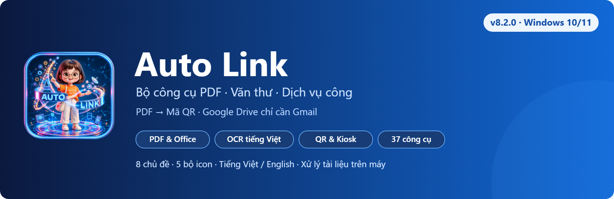</h1>

<b>Bộ công cụ PDF, Văn thư &amp; Dịch vụ công cho bộ phận một cửa — File → Link (Word → Hyperlink · Link Google Drive), Ảnh → PDF có link, Link → Mã QR, PDF → Mã QR, Đối chiếu dữ liệu, OCR tiếng Việt, ⇄ Đảo tính năng và 37 công cụ PDF / Office trong một ứng dụng Windows. Dùng thử miễn phí 3 ngày.</b>

🇻🇳 <b>Tiếng Việt</b> · 🇬🇧 <a href="docs/readme/README.en.md">English</a>

  &nbsp;
  &nbsp;
  

  
  
  
  
  
  
  
  
  

  <a href="#-cài-đặt">📥 Cài đặt</a> ·
  <a href="#-tính-năng">✨ Tính năng</a> ·
  <a href="#-các-chức-năng">🧭 Các chức năng</a> ·
  <a href="#-đảo-tính-năng">⇄ Đảo tính năng</a> ·
  <a href="#-bộ-công-cụ--37-công-cụ--5-nhóm">🧰 37 công cụ</a> ·
  <a href="#-bảng-giá--kích-hoạt">💳 Bảng giá</a> ·
  <a href="#-liên-hệ--hỗ-trợ">📞 Liên hệ</a> ·
  <a href="#-dữ-liệu--quyền-riêng-tư">🔒 Quyền riêng tư</a> ·
  <a href="#-xử-lý-sự-cố">🛟 Xử lý sự cố</a> ·
  <a href="#-nhật-ký-thay-đổi">📜 Thay đổi</a>

> **Bản phát hành hiện tại: [8.3.0 · 10/10/2026](https://github.com/mikeTran99/Auto-Link/releases/tag/v8.3.0).** Mới: **Kiểm tra thể thức theo Nghị định 30/2020** (29 loại văn bản, xem và **duyệt từng sửa đổi** hoặc duyệt tất cả, sửa trên bản sao) và **nhận dạng chữ qua Google Drive** (tuỳ chọn — chính xác hơn với scan mờ, chữ in hoa nhiều dấu).

Ảnh minh họa đã che thông tin tài khoản, đường dẫn riêng và toàn bộ mã QR. QR thanh toán thực tế nằm trong ứng dụng; thời gian dùng thử và giá áp dụng theo cấu hình hiển thị trong app.

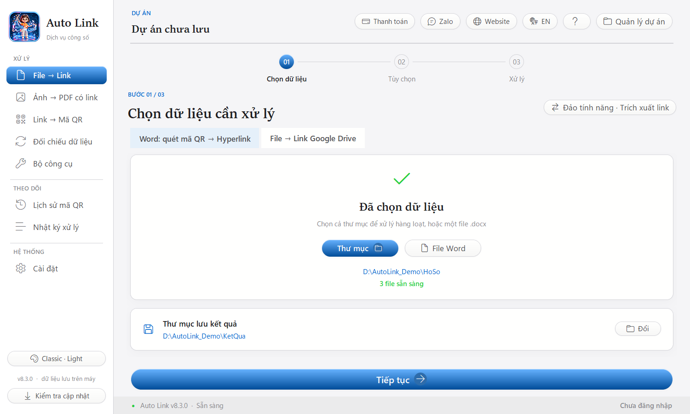

---

## 📥 Cài đặt

### 1️⃣ Tải về

Vào **[Releases](https://github.com/mikeTran99/Auto-Link/releases/latest)** và chọn một cách (khuyên dùng **bộ cài**):

| | Tệp | Dùng khi | Ghi chú |
|:-:|---|---|---|
| ⭐ | **[Auto-Link-Setup.exe](https://github.com/mikeTran99/Auto-Link/releases/latest/download/Auto-Link-Setup.exe)** | **Cài mới / cài lại (khuyên dùng)** | Bộ cài **từng bước**: chọn thư mục → ☑ **tạo lối tắt Desktop** → cài → mở app; có lối tắt menu Start, gỡ trong **Settings › Apps**, không cần quyền quản trị |
| 🚀 | **[Auto-Link-win.exe](https://github.com/mikeTran99/Auto-Link/releases/latest/download/Auto-Link-win.exe)** | Dùng ngay trên 1 máy | 1 tệp duy nhất — bấm đúp là chạy, không cần cài |
| 📦 | **[Auto-Link-win-setup.zip](https://github.com/mikeTran99/Auto-Link/releases/latest/download/Auto-Link-win-setup.zip)** | Cài cho cả cơ quan | Lối tắt Start + Desktop, gỡ trong **Settings › Apps**, IT chép lên thư mục mạng để các máy **tự cập nhật** |
| 🔐 | **[SHA256SUMS.txt](https://github.com/mikeTran99/Auto-Link/releases/latest/download/SHA256SUMS.txt)** + **[SHA256SUMS.txt.sig](https://github.com/mikeTran99/Auto-Link/releases/latest/download/SHA256SUMS.txt.sig)** | Kiểm tra tệp tải về | Mã SHA-256 và chữ ký phát hành; app kiểm cả hai trước khi cập nhật |

### 2️⃣ Chạy / cài đặt

<b>⭐ Bộ cài từng bước — Auto-Link-Setup.exe</b>

 

1. Bấm đúp **`Auto-Link-Setup.exe`** → **Chào mừng** → **Tiếp**.
2. **Thư mục cài** (mặc định `%LOCALAPPDATA%\Programs\AutoLink`, không cần quyền quản trị) → **Tiếp**.
3. ☑ **Tạo lối tắt Auto Link trên Desktop** (đã tích sẵn) → **Tiếp** → **Cài đặt**.
4. **Hoàn tất** — ☑ **Mở Auto Link ngay**. Có lối tắt ở Desktop + menu Start; gỡ trong **Settings › Apps**.

Cài đè bản cũ được (bộ cài tự đóng app đang mở); dữ liệu, cài đặt giữ nguyên.

<b>🚀 Chạy trực tiếp — Auto-Link-win.exe</b>

 

1. Bấm đúp **`Auto-Link-win.exe`**.
2. Lần đầu mở mất vài giây để giải nén; các lần sau nhanh hơn.

> [!TIP]
> Nếu hiện bảng xanh **"Windows protected your PC"** (SmartScreen): bấm **More info** → **Run anyway**. EXE chưa có chứng thư ký mã Windows. Bản tải về được bảo vệ bằng SHA-256 và chữ ký phát hành của tác giả; chỉ tải từ trang Releases chính thức.

<b>📦 Cài cho người dùng / cả cơ quan — Auto-Link-win-setup.zip</b>

 

1. Giải nén **`Auto-Link-win-setup.zip`** (chuột phải → **Extract All**).
2. Bấm đúp **`Cai_dat.cmd`** → ứng dụng cài vào `%LOCALAPPDATA%\Programs\AutoLink` — **không cần quyền quản trị**, có lối tắt Start + Desktop, mục gỡ trong **Settings › Apps**.
3. Bộ cài tự kiểm tra mã **SHA-256** của `Auto_Link.exe` theo `version.json`: tệp chép dở / bị sửa sẽ không được cài.

> [!NOTE]
> **Cho IT — tự cập nhật qua mạng nội bộ:** chép thư mục đã giải nén lên 1 thư mục mạng mà **chỉ IT có quyền ghi** (vd `\\may_chu\PhanMem\AutoLink`), người dùng chạy `Cai_dat.cmd` từ đó. Có bản mới → chép đè thư mục đó; lần mở kế tiếp mỗi máy tự thấy, hỏi rồi tự thay (kiểm tra SHA-256 trước khi thay, lỗi thì tự quay về bản cũ).

### 3️⃣ Đăng nhập & dùng thử

Lần đầu mở: nhập **Gmail** → dùng thử **miễn phí 3 ngày**, đủ mọi chức năng. Hết dùng thử, app hiện thông báo **nâng cấp gói Pro — từ 49.000đ / tháng (có gói 3, 6, 12 tháng tiết kiệm hơn)** để tiếp tục dùng tất cả chức năng (xem **[💳 Bảng giá](#-bảng-giá--kích-hoạt)**).

> [!NOTE]
> **Tự cập nhật:** có bản mới trên GitHub, app hiện thanh thông báo kèm ghi chú phiên bản → bấm **Cập nhật ngay** là tải, kiểm **chữ ký số + SHA-256** rồi thay file và tự mở lại. Bản tải về bị sửa sẽ không được cài.

### 4️⃣ Kiểm tra máy

Mở **⚙️ Cài đặt › ✅ Kiểm tra hệ thống** để kiểm tra QR, PDF, OCR, bản quyền và các thành phần trên máy. Các mục xuất PDF bằng Office cần Microsoft Office tương ứng.

### 💻 Yêu cầu hệ thống

| | Thành phần | Yêu cầu |
|:-:|---|---|
| 🪟 | Hệ điều hành | Windows 10 / 11 **64-bit** |
| 🖥️ | Màn hình | **Mọi cỡ**: từ 1024 × 768 tới 4K, phóng chữ **100 – 250 %**, laptop 14 inch, máy tính bảng; cửa sổ thu nhỏ / Snap nửa màn hình vẫn đủ thành phần |
| 📎 | Microsoft Office 2013+ | Cần cho **Word / Excel / PowerPoint → PDF**, nối file Office và xuất PDF khi trộn văn bản |
| 🌐 | Mạng | Xử lý tài liệu **không cần mạng**. Cần mạng khi đăng nhập / kích hoạt bản quyền, cập nhật, **Cào link** hoặc đối chiếu danh mục TTHC với Cổng DVC |

---

## ✨ Tính năng

<table>
<tr>
<td width="33%" valign="top">

### 📝 File → Link
**Word → Hyperlink:** mọi URL dạng chữ trong `.docx` (kể cả trong bảng) thành **link bấm được**, quét **ảnh mã QR** trong bảng, xuất **Word + PDF**. **→ Link Google Drive:** mọi loại file, cả thư mục → mỗi file 1 link chia sẻ.

</td>
<td width="33%" valign="top">

### 🖼️ Ảnh → PDF có link
Ảnh `.jpg / .png…` thành PDF, **bấm vào ảnh là mở link** — tờ rơi, poster hướng dẫn thủ tục.

</td>
<td width="33%" valign="top">

### 🔳 Link → Mã QR
Dán danh sách hoặc **cào link đúng theo trang** (Cổng DVC Quốc gia & mọi website), **tích từng link**, tìm không dấu, lọc thư mục; mã QR **mức sửa lỗi H**.

**Mới 8.2.0 — PDF → Mã QR:** file PDF trong máy → mỗi file 1 mã QR quét là mở file. **Danh mục TTHC (Excel) → QR + Kiosk:** đọc nhiều sheet, đối chiếu thủ tục trên Cổng DVC, xuất trang tra cứu cảm ứng tự chứa, Excel kết quả và Word danh mục có mã QR.

</td>
</tr>
<tr>
<td valign="top">

### 📊 Theo dõi thủ tục
So với lần cào trước: thủ tục **mới**, **không còn**, **đổi tên / lĩnh vực** — ghi vào Nhật ký xử lý.

</td>
<td valign="top">

### 🧰 37 công cụ · 5 nhóm
Xếp theo việc cần làm + **ô tìm nhanh**: hàng loạt theo công thức, trộn văn bản, **số hóa hồ sơ**, sổ **văn bản đến**, **thể thức NĐ 30**, so sánh văn bản, **PDF/A**, che thông tin cá nhân…

</td>
<td valign="top">

### 🔤 OCR tiếng Việt
Tích hợp sẵn Tesseract 5 + mô hình tiếng Việt — PDF scan thành **PDF tìm kiếm được**, Word, Excel. Không cần cài thêm.

</td>
</tr>
<tr>
<td valign="top">

### ↩️ Khôi phục mọi lúc
Hoàn tác lượt vừa làm: file mới vào **Thùng rác**, file bị ghi đè **trả bản cũ**, đổi tên **trả tên cũ**. Nút **Xử lý tiếp** làm file khác ngay.

</td>
<td valign="top">

### 🗂️ Nhật ký & Lịch sử
**Ô tích chọn** từng dòng: sao chép, xuất, xoá, **khôi phục** mục đã xoá. Sổ lịch sử mã QR lưu vĩnh viễn (mở bằng Excel).

</td>
<td valign="top">

### 🔒 Riêng tư · ⌨️ Bàn phím
Tài liệu xử lý **100 % trên máy**, không tải lên đâu; dùng được hoàn toàn bằng bàn phím; tự co giãn theo màn hình.

</td>
</tr>
<tr>
<td valign="top">

### ⇄ Đảo tính năng
Mỗi chức năng chính có nút **đảo chiều**: trích xuất link từ Word / PDF, PDF → ảnh + link, **đọc mã QR → link** hàng loạt.

</td>
<td valign="top">

### 🖥️ Mọi màn hình
Từ 1024 × 768 tới **4K**, phóng chữ 100 – 250 %: menu thu gọn khi hẹp, hàng nút tự xuống dòng, trang dài cuộn được.

</td>
<td valign="top">

### 🗂️ Sắp xếp khoa học
Menu theo nhóm **Xử lý · Theo dõi · Hệ thống**; Bộ công cụ 5 nhóm **thu gọn kiểu accordion** — bấm nhóm nào mở nhóm đó, tìm nhanh gõ không dấu.

</td>
</tr>
<tr>
<td valign="top">

### 🎨 8 chủ đề · 5 bộ icon
**Neumorphism** sáng / tối, **Glass · Aurora**, **Next-Gen · Holo** cùng 4 chủ đề cổ điển; bộ icon Fluent, Fluent màu, Cổ điển, Emoji, Nét mảnh; hiệu ứng chuyển động mượt (tắt được).

</td>
<td valign="top">

### 🌐 Tiếng Việt ⇄ English
Nút **EN / VI** trên thanh đầu đổi toàn bộ giao diện ngay lập tức, không cần mở lại app.

</td>
<td valign="top">

### 🔄 Tự cập nhật · 💳 Dùng thử
Bản mới trên GitHub → **1 bấm để cập nhật** (kiểm chữ ký phát hành và SHA-256). Dùng thử **3 ngày**, rồi **gói Pro từ 49.000đ / tháng** (1 / 3 / 6 / 12 tháng); app **tự nhận bản quyền khi thanh toán được xác nhận**.

</td>
</tr>
<tr>
<td valign="top">

### ☁️ Google Drive · chỉ cần Gmail
Bấm **Đăng nhập Google** → chọn Gmail → Cho phép. Không cần Client ID / secret. Tải **hàng nghìn file**: Google bận thì **tự chờ rồi tải tiếp**, tắt app vẫn **tải tiếp đúng chỗ dừng**, không trùng.

</td>
<td valign="top">

### 📄 PDF → Mã QR · mới 8.2.0
Chọn file / thư mục PDF → tải lên Drive của bạn → **mỗi file 1 mã QR** theo thiết kế, giữ cây thư mục — in dán hồ sơ, kiosk, bảng niêm yết.

</td>
<td valign="top">

### 🔄 Đối chiếu dữ liệu
Danh mục TTHC bản mới (Quyết định PDF / Word, Excel, link Google Sheet) ↔ bản đang dùng → tự phân loại, so theo mã, xem lại từng thay đổi rồi **Duyệt cập nhật**.

</td>
</tr>
</table>

---

## 🧭 Các chức năng

### 📝 File → Link — nhánh Word → Hyperlink

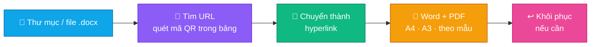
```mermaid
flowchart LR
    A["📁 Thư mục / file .docx"]:::blue --> B["🔎 Tìm URL<br/>quét mã QR trong bảng"]:::violet
    B --> C["🔗 Chuyển thành<br/>hyperlink"]:::green
    C --> D["📄 Word + PDF<br/>A4 · A3 · theo mẫu"]:::amber
    D --> E["↩️ Khôi phục<br/>nếu cần"]:::pink
    classDef blue fill:#0EA5E9,stroke:#0369A1,color:#fff
    classDef violet fill:#8B5CF6,stroke:#6D28D9,color:#fff
    classDef green fill:#10B981,stroke:#047857,color:#fff
    classDef amber fill:#F59E0B,stroke:#B45309,color:#fff
    classDef pink fill:#EC4899,stroke:#BE185D,color:#fff
```

| 1️⃣ Chọn dữ liệu | 2️⃣ Tuỳ chọn |
|---|---|
|  | 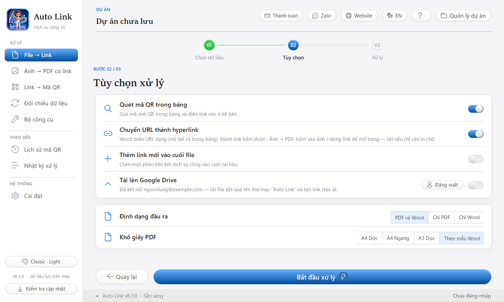 |

- 🔎 **Quét mã QR trong bảng** — giải mã ảnh QR trong bảng và điền link vào ô kế bên.
- ➕ **Thêm link mới vào cuối file** — chèn phần liên kết dịch vụ công (địa chỉ + chữ hiển thị tuỳ chọn).
- 📄 **Định dạng đầu ra** — PDF và Word / chỉ PDF / chỉ Word · **Khổ giấy**: A4 dọc, A4 ngang, A3 dọc, theo mẫu Word.

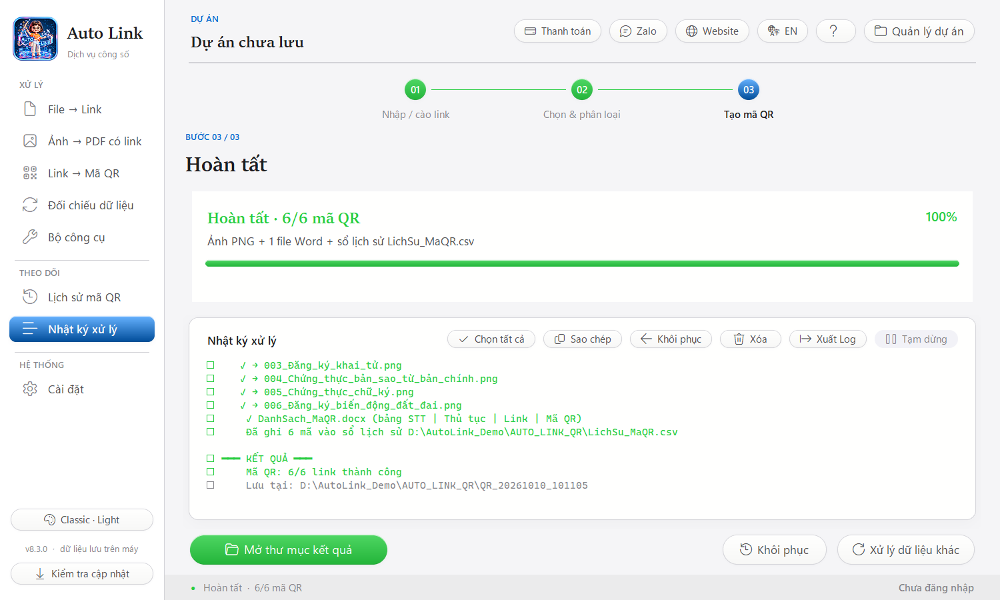

**3️⃣ Xử lý:** tiến độ từng file, nhật ký chi tiết có ô tích, **📂 Mở thư mục kết quả** và **↩️ Khôi phục** cả lượt.

### ☁️ File / Ảnh → Link Google Drive

Chọn file mọi loại hoặc cả thư mục (gồm thư mục con) → **Tải lên & lấy link**: mỗi file 1 link chia sẻ (Chỉ xem / Nhận xét / Chỉnh sửa / Riêng tư), giữ cây thư mục trên Drive; **Chép tất cả link**, **Xuất Excel**, bật **Tạo mã QR cho mỗi file**.

| Nhánh Link Google Drive | Đăng nhập — chỉ cần Gmail |
|---|---|
| 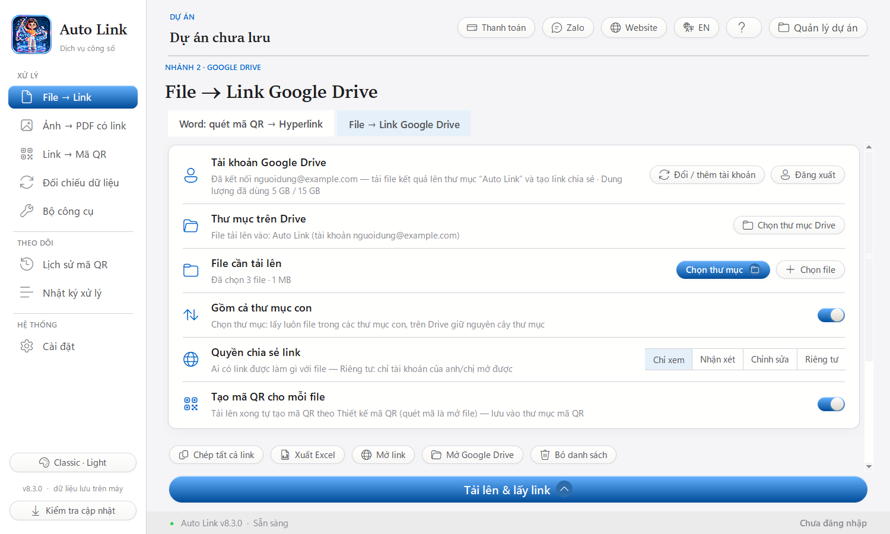 | 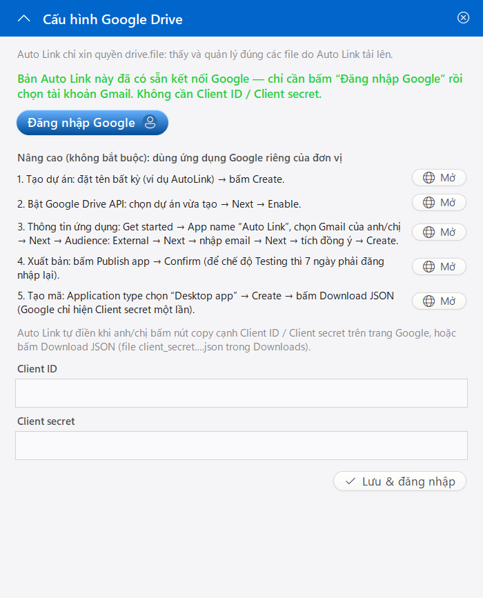 |

- 🔐 Chỉ xin quyền `drive.file`: app **chỉ thấy file do chính nó tải lên**, không đọc Drive của bạn. Nhiều tài khoản Google, chọn / tạo thư mục đích, xem dung lượng.
- ⏳ Nhiều người cùng tải: Google báo bận → app **tự chờ rồi tải tiếp** + **tự điều tốc**; tắt app / mất mạng → mở lại báo "Còn N file", bấm **Tải lên** chỉ tải phần còn lại. **Bỏ danh sách** để xoá.

### 🖼️ Ảnh → PDF có link

Chọn ảnh → nhập link → mỗi ảnh thành 1 trang PDF, **bấm vào ảnh là mở link**.

### 🔳 Link → Mã QR

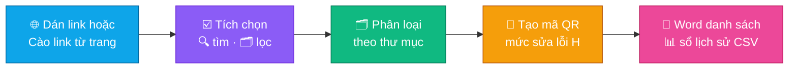
```mermaid
flowchart LR
    A["🌐 Dán link hoặc<br/>Cào link từ trang"]:::blue --> B["☑️ Tích chọn<br/>🔍 tìm · 🗂️ lọc"]:::violet
    B --> C["🗂️ Phân loại<br/>theo thư mục"]:::green
    C --> D["🔳 Tạo mã QR<br/>mức sửa lỗi H"]:::amber
    D --> E["📄 Word danh sách<br/>📊 sổ lịch sử CSV"]:::pink
    classDef blue fill:#0EA5E9,stroke:#0369A1,color:#fff
    classDef violet fill:#8B5CF6,stroke:#6D28D9,color:#fff
    classDef green fill:#10B981,stroke:#047857,color:#fff
    classDef amber fill:#F59E0B,stroke:#B45309,color:#fff
    classDef pink fill:#EC4899,stroke:#BE185D,color:#fff
```

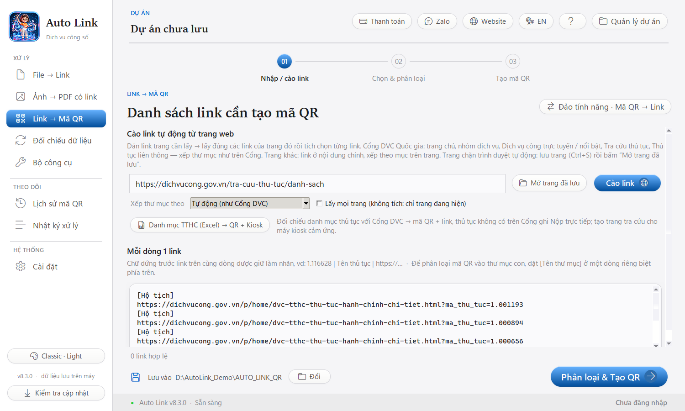

- 🌐 **Cào link bám đúng trang đã dán** — Cổng DVC Quốc gia: trang chủ, nhóm dịch vụ, Dịch vụ công trực tuyến, Tra cứu thủ tục, Thủ tục liên thông; xếp thư mục như trên Cổng (lĩnh vực, cơ quan, đối tượng…). Trang khác: link ở nội dung chính, bỏ menu / đầu / chân trang.
- 💾 Trang chặn trình duyệt tự động: lưu trang (**Ctrl+S**) rồi bấm **Mở trang đã lưu**.
- ☑️ **Tích từng link hoặc cả thư mục** — chỉ tạo mã cho link đã chọn; danh sách trên 500 link không tự chọn hết để tránh nặng máy.

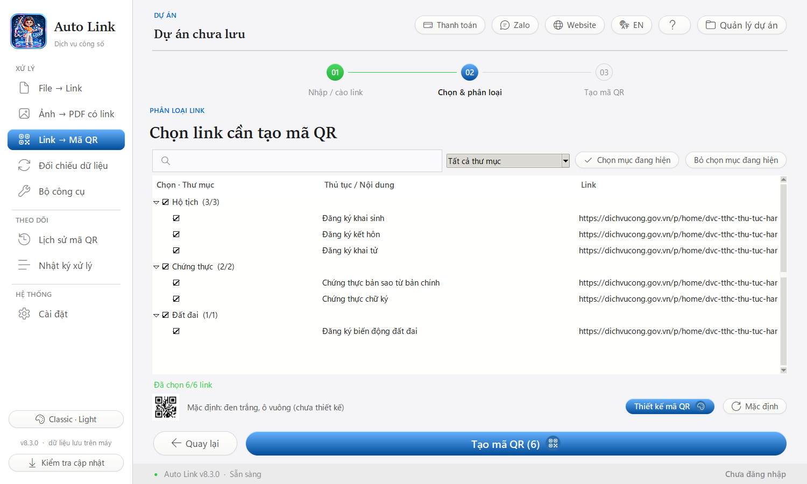

> [!TIP]
> Gõ **không dấu** vẫn tìm ra (`ho tich` → *Hộ tịch*). Đặt `[Tên thư mục]` ở một dòng riêng phía trên nhóm link để tự xếp mã QR vào thư mục con.

### 🖥️ Danh mục TTHC (Excel) → QR + Kiosk · mới trong 8.0.1

Từ danh mục thủ tục của đơn vị, tạo bộ tra cứu để đặt tại quầy một cửa hoặc máy kiosk cảm ứng.

1. Mở **Link → Mã QR › Danh mục TTHC (Excel) → QR + Kiosk**, hoặc **Bộ công cụ › Link & Mã QR**.
2. Chọn Excel có cột **Mã TTHC / Tên thủ tục / Lĩnh vực / Link**; đọc nhiều sheet, mỗi sheet có thể là một bộ phận. Công cụ chuẩn hóa mã bị lệch định dạng.
3. Đối chiếu Cổng DVC Quốc gia theo mã; nếu không có mã, dùng tên chính xác. Thủ tục có trên Cổng nhận link và QR; không tìm thấy thì ghi **Nộp trực tiếp** để bạn rà soát.

| Chọn danh mục Excel | Trang tra cứu kiosk cảm ứng |
|---|---|
| 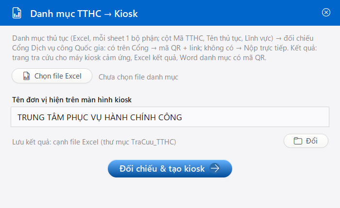 | 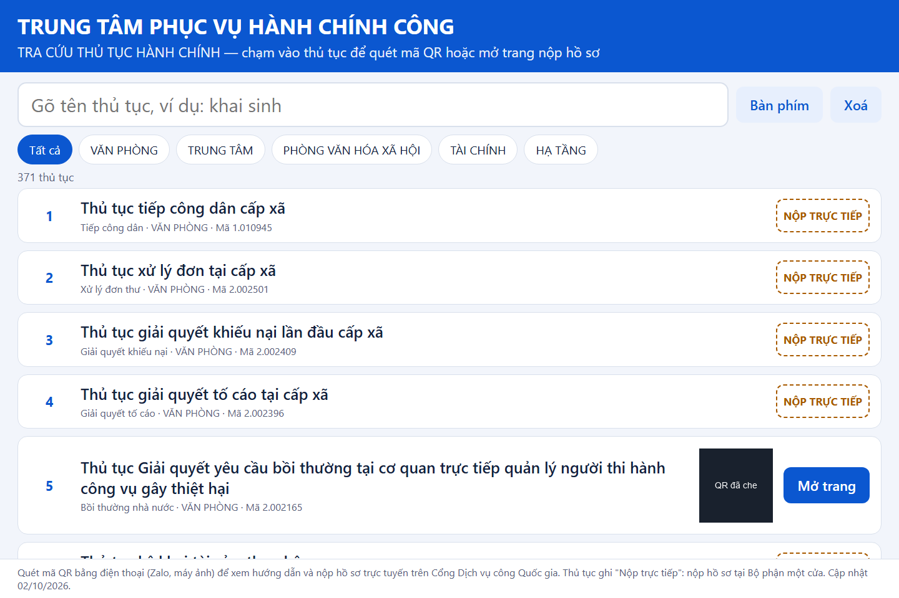 |

| Kết quả | Công dụng |
|---|---|
| `Kiosk_TraCuuTTHC/index.html` + `Mo_kiosk.cmd` | Trang tự chứa: tìm không dấu, bàn phím ảo, lọc bộ phận, mở trang thủ tục; tự về màn đầu sau 2 phút; mở bằng Edge chế độ kiosk |
| `DanhMuc_TTHC_KetQua.xlsx` | Danh sách kết quả có link, thuận tiện kiểm tra và cập nhật |
| `DanhMuc_TTHC_MaQR.docx` + `QR/` | Danh mục Word có QR theo bộ phận và các ảnh mã để in niêm yết |

Trang kiosk đã xuất có thể tra cứu khi mất mạng; bước đối chiếu Cổng DVC và mở trang thủ tục cần Internet. Khi danh mục thay đổi, chạy lại công cụ để cập nhật bộ tra cứu.

### ✅ Kiểm tra thể thức NĐ 30/2020 · mới 8.3.0

Chọn file Word → app soát **29 loại văn bản hành chính** (tự nhận biết loại) theo **6 nhóm**: trang & lề, phông & cỡ chữ,
đoạn văn, 9 thành phần chính, thành phần bổ sung, chính tả & dấu câu. Mỗi lỗi là 1 dòng *hiện tại → đề xuất*: **tích
từng mục hoặc Duyệt tất cả**; mục cần sửa tay ghi rõ hướng dẫn. Kết quả là **bản sao** `…_dung_the_thuc.docx` (file gốc
giữ nguyên) + báo cáo Excel. Quy tắc riêng của đơn vị (cỡ chữ, lề…) nhập / xuất được.

| Chọn loại văn bản + nhóm kiểm tra | Duyệt từng đề xuất |
|---|---|
| 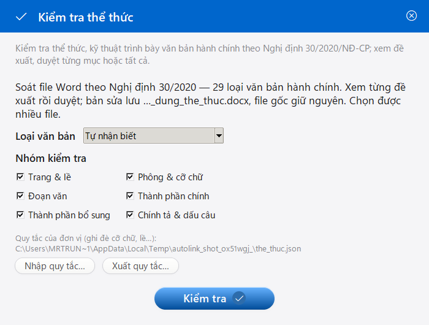 | 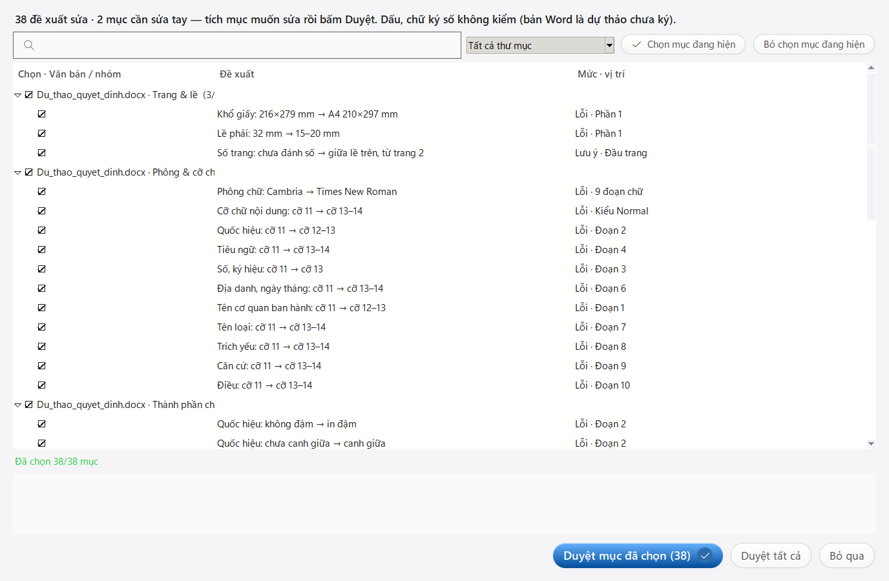 |

**Nhận dạng chữ qua Google Drive** (Cài đặt › Nhận dạng chữ › Google — mặc định **Máy này**): scan mờ, chữ IN HOA nhiều
dấu đọc chính xác hơn; ảnh từng trang lên **Drive của chính bạn** rồi xoá ngay, lỗi mạng thì tự dùng Tesseract.

### 📄 PDF → Mã QR · mới trong 8.2.0

Mã QR chỉ chứa ~3 KB nên không chứa nổi cả file: **Bộ công cụ › Link & Mã QR › PDF → Mã QR** → **Chọn file PDF** / **Chọn thư mục PDF** → app tải lên Google Drive của bạn (ai có link đều xem) rồi tạo **mỗi file 1 mã QR** theo Thiết kế mã QR, giữ cây thư mục. Lần đầu chỉ cần đăng nhập Gmail.

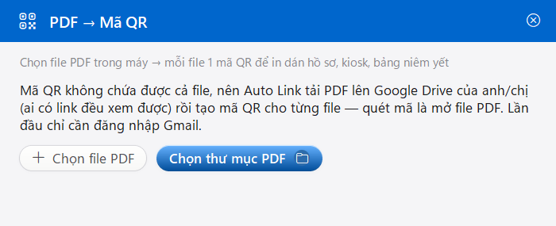

### 🔄 Đối chiếu dữ liệu

Giữ danh mục TTHC luôn đúng: chọn **nguồn cố định** (file Excel hoặc link Google Sheet / Drive) + **văn bản cần cập nhật** (Quyết định công bố PDF / Word, danh mục Excel / CSV) → app tự phân loại thủ tục về đúng nguồn, so chính xác theo mã → xem lại từng dòng **thêm / bỏ / sửa** → **Duyệt cập nhật** (thử ghi trên bản sao, kiểm lại từng dòng rồi mới ghi).

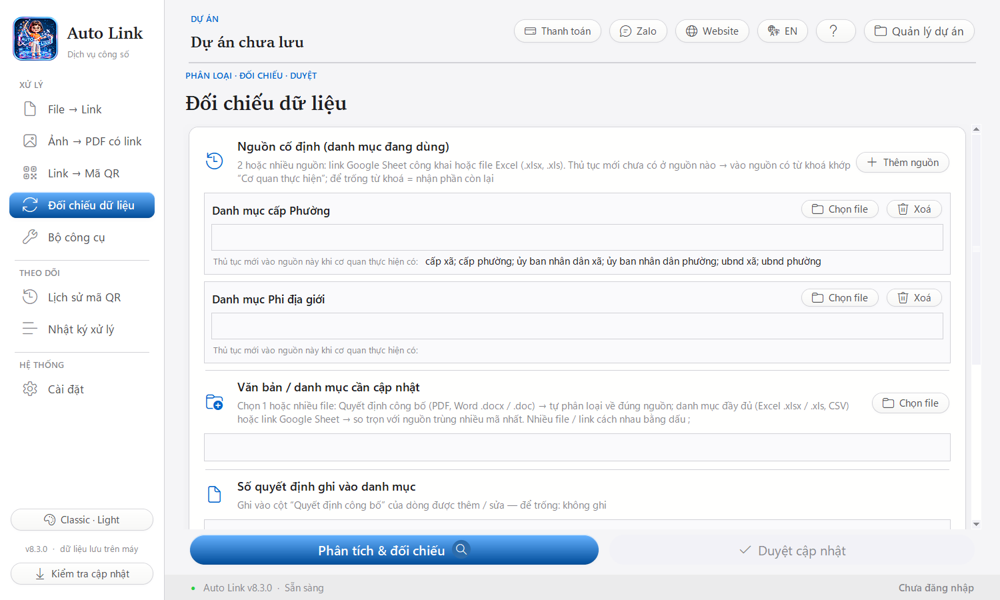

### 🗂️ Lịch sử mã QR & Nhật ký xử lý

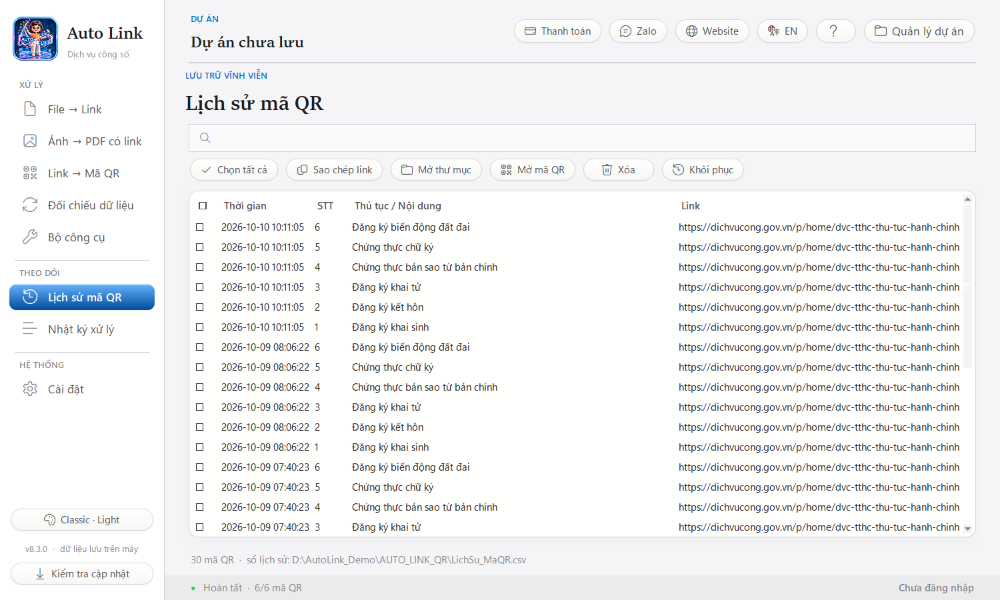

Lưu **vĩnh viễn** mọi mã đã tạo: 🔍 tìm kiếm · ☑️ tích chọn · 📋 sao chép link · 🔳 mở mã / 📂 thư mục · 🗑️ xoá (có sao lưu) · ↩️ **khôi phục** mục vừa xoá.

---

## ⇄ Đảo tính năng

Bên phải tiêu đề mỗi chức năng chính có nút **⇄ Đảo tính năng** — mở chức năng **chiều ngược**, phục vụ việc thường gặp ở bộ phận một cửa: nhận văn bản có sẵn link / mã QR và cần lấy lại danh sách.

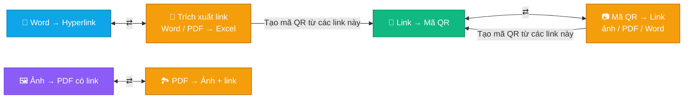
```mermaid
flowchart LR
    A["📝 Word → Hyperlink"]:::blue <-->|⇄| B["🔗 Trích xuất link<br/>Word / PDF → Excel"]:::amber
    C["🖼️ Ảnh → PDF có link"]:::violet <-->|⇄| D["🏞️ PDF → Ảnh + link"]:::amber
    E["🔳 Link → Mã QR"]:::green <-->|⇄| F["📷 Mã QR → Link<br/>ảnh / PDF / Word"]:::amber
    B -->|"Tạo mã QR từ các link này"| E
    F -->|"Tạo mã QR từ các link này"| E
    classDef blue fill:#0EA5E9,stroke:#0369A1,color:#fff
    classDef violet fill:#8B5CF6,stroke:#6D28D9,color:#fff
    classDef green fill:#10B981,stroke:#047857,color:#fff
    classDef amber fill:#F59E0B,stroke:#B45309,color:#fff
```

| Chức năng chính | ⇄ Đảo tính năng | Kết quả |
|---|---|---|
| 📝 Word → Hyperlink | 🔗 **Trích xuất link** | Mọi link trong Word / PDF (hyperlink, link dạng chữ — cả trong bảng, mã QR trong ảnh): **Tất cả link** (mã + **tên thủ tục**, file, vị trí, nguồn) + **Link duy nhất** (gộp trùng). Tuỳ chọn **gỡ hyperlink**, giữ nguyên chữ |
| 🖼️ Ảnh → PDF có link | 🏞️ **PDF → Ảnh + link** | Mỗi trang PDF 1 ảnh JPG (100 – 300 dpi, mỗi PDF 1 thư mục) + danh sách link (kèm tên thủ tục) của từng trang |
| 🔳 Link → Mã QR | 📷 **Mã QR → Link** | Đọc **mọi** mã QR (nhiều mã / trang) trong ảnh, PDF (cả bản scan), Word → link / nội dung + **mã, tên thủ tục** |

**Chọn định dạng báo cáo:** 📊 Excel · 📝 Word · 📕 PDF · 📄 TXT · 🧾 CSV · hoặc **📎 theo file gốc** (Word → Word, PDF → PDF) — app nhớ lựa chọn cho lần sau. Tên thủ tục lấy từ chữ quanh link trong văn bản, sổ theo dõi TTHC và lịch sử mã QR.

| 🔗 Trích xuất link | 🏞️ PDF → Ảnh + link | 📷 Mã QR → Link |
|---|---|---|
| 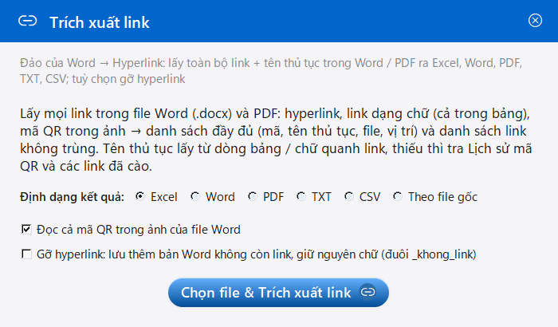 | 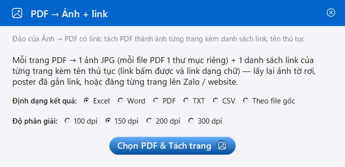 |  |

> [!TIP]
> Trích hoặc đọc được link thì bấm **“Tạo mã QR từ các link này”** — danh sách sang thẳng **Link → Mã QR** (giữ nhãn, bỏ link trùng) để phân loại và tạo mã mới.

---

## 🧰 Bộ công cụ — 37 công cụ · 5 nhóm

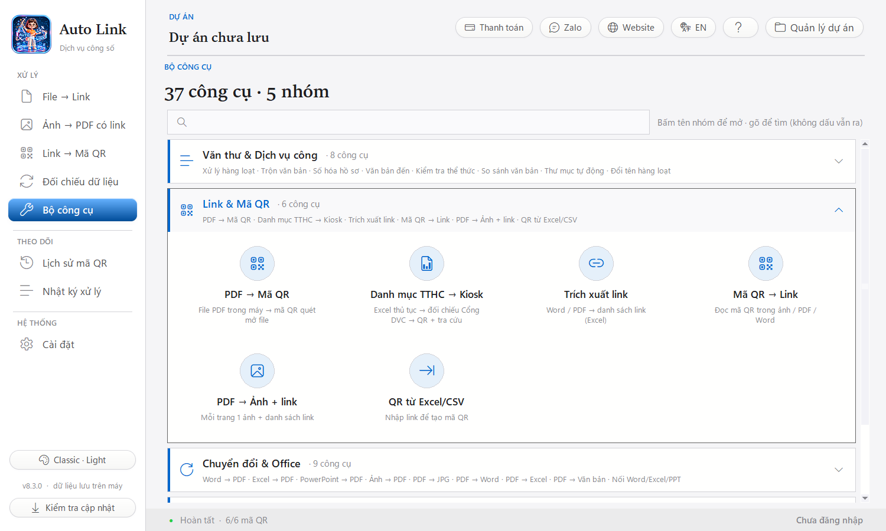

| Nhóm | Công cụ |
|---|---|
| 🏛️ **Văn thư & Dịch vụ công (8)** | ⚡ Xử lý hàng loạt (lưu thành công thức) · ✉️ Trộn văn bản (mẫu Word + Excel) · 🗄️ Số hóa hồ sơ (scan → PDF tìm kiếm được + sổ danh mục) · 📥 Văn bản đến (tự điền sổ đăng ký) · 📐 Kiểm tra thể thức (NĐ 30) · 🔍 So sánh văn bản · 📂 Thư mục tự động (máy scan thả file → tự xử lý) · 🏷️ Đổi tên hàng loạt |
| 🔗 **Link & Mã QR (6)** | 📄 **PDF → Mã QR** (mới) · 🖥️ Danh mục TTHC → Kiosk · 🔗 Trích xuất link · 📷 Mã QR → Link · 🏞️ PDF → Ảnh + link · 🔳 QR từ Excel / CSV |
| 🔁 **Chuyển đổi & Office (9)** | 📘 Word / 📗 Excel / 📙 PowerPoint → PDF · 🖼️ Ảnh → PDF · 🏞️ PDF → JPG (150 – 600 dpi) · 📝 PDF → Word · 📊 PDF → Excel · 🔤 PDF → Văn bản (OCR) · 🧩 Nối Word / Excel / PowerPoint |
| 📕 **Sắp xếp & chỉnh sửa PDF (8)** | 🔗 Nối · ✂️ Tách · 🗑️ Xoá trang · 🔀 Sắp xếp trang · 🔄 Xoay · 📏 Cắt lề · 🔢 Đánh số trang · 💧 Dấu bản quyền |
| 🔒 **Bảo mật, tối ưu & lưu trữ (6)** | 🔒 Đặt mật khẩu · 🔓 Gỡ mật khẩu · 🕶️ Che thông tin cá nhân (CCCD, SĐT, email…) · 🗜️ Nén · 🩹 Sửa tệp lỗi · 🏛️ Xuất PDF/A lưu trữ |

Các nhóm **thu gọn sẵn** — bấm tên nhóm để mở (nhóm khác tự đóng, trượt mượt). Ô **tìm nhanh**: gõ không dấu vẫn ra (`ma qr`, `nen pdf`, `the thuc`…), nhóm có kết quả tự mở.

| ⚡ Xử lý hàng loạt | 🗄️ Số hóa hồ sơ |
|---|---|
| 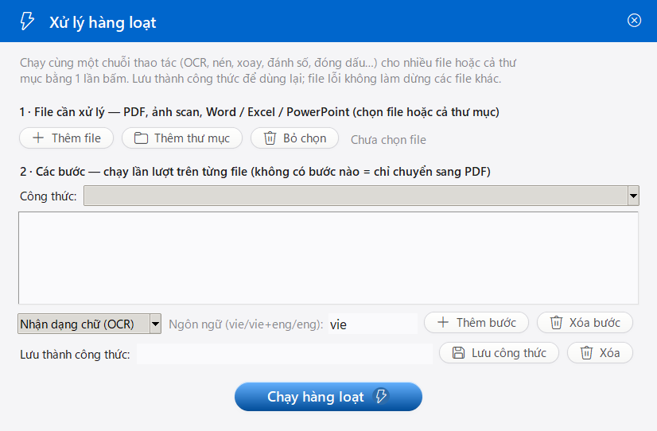 | 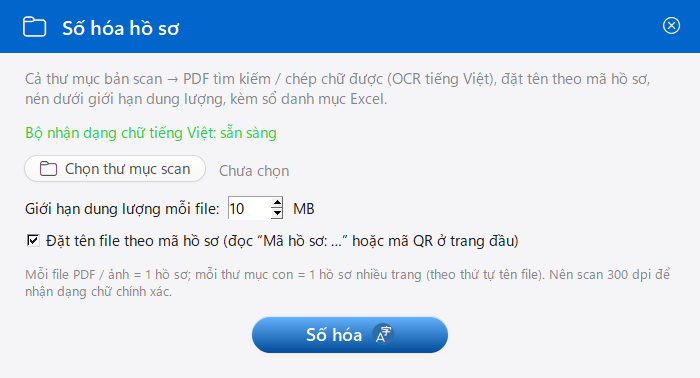 |

Mỗi công cụ báo kết quả kèm **📄 Mở file / 📂 Mở thư mục**, **🔁 Xử lý tiếp** và **↩️ Khôi phục**; mọi thao tác ghi vào **Nhật ký xử lý**.

---

## ⚙️ Cài đặt & 🎨 giao diện

| ⚙️ Cài đặt | 🌙 Giao diện tối — Obsidian · Gold |
|---|---|
| 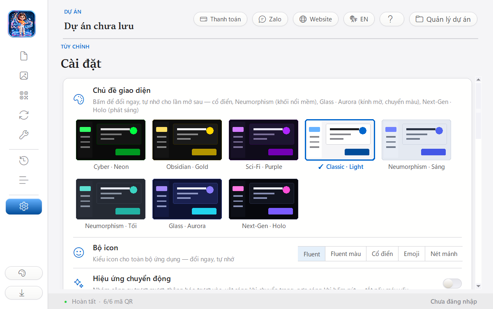 | 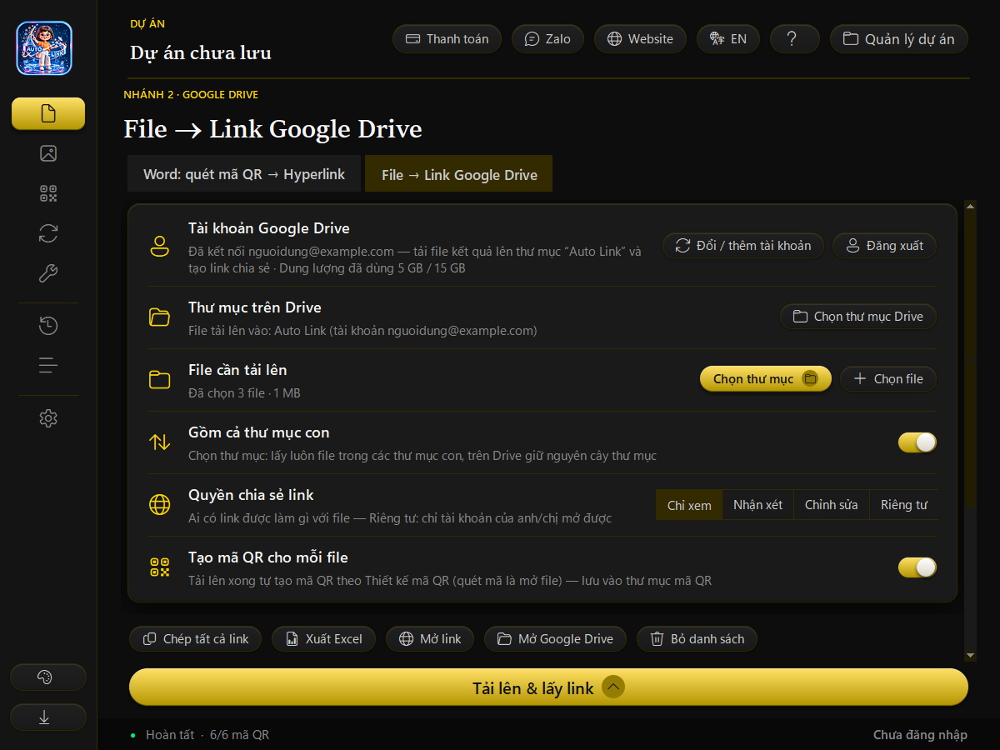 |

🎨 **8 chủ đề** (bấm ô màu là đổi) · 🔣 **5 bộ icon** · ✨ hiệu ứng chuyển động · 🌐 ngôn ngữ Tiếng Việt / English · 👤 tài khoản & bản quyền · 📁 Thư mục mã QR / dự án · ✅ Kiểm tra hệ thống · 🧾 Nhật ký lỗi · 💾 Sao lưu / khôi phục (chuyển máy) · 🔄 Cập nhật phần mềm · ⌨️ Phím tắt **Ctrl+N / Ctrl+S / Ctrl+O**, **Tab / Shift+Tab**, **Enter / Space**, **Esc**.

| 🌌 Glass · Aurora | ☁️ Neumorphism · Sáng | 🌈 Next-Gen · Holo |
|---|---|---|
| 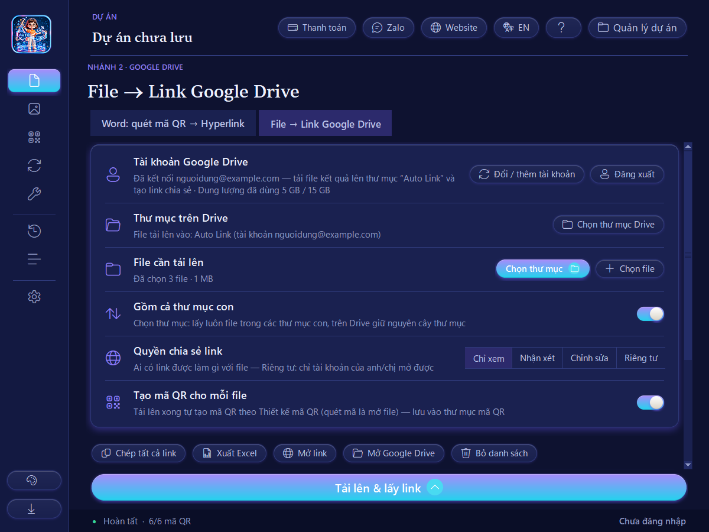 | 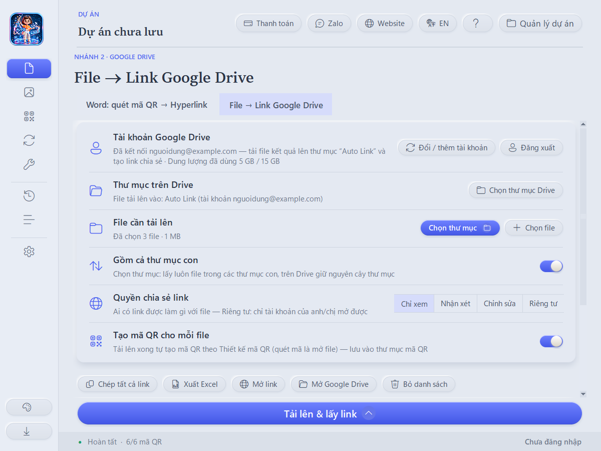 | 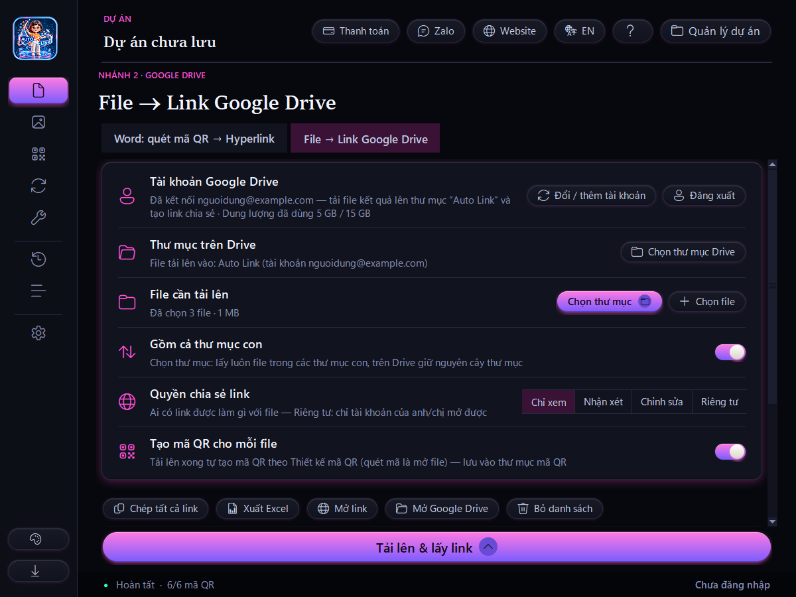 |

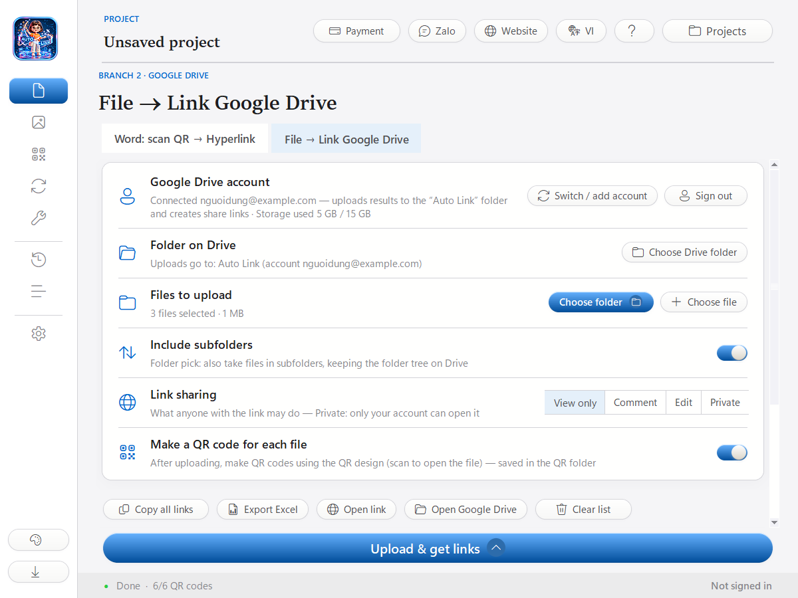 Nút <b>EN / VI</b>: cả giao diện sang tiếng Anh ngay lập tức

---

### 🖥️ Mọi màn hình, mọi thiết bị

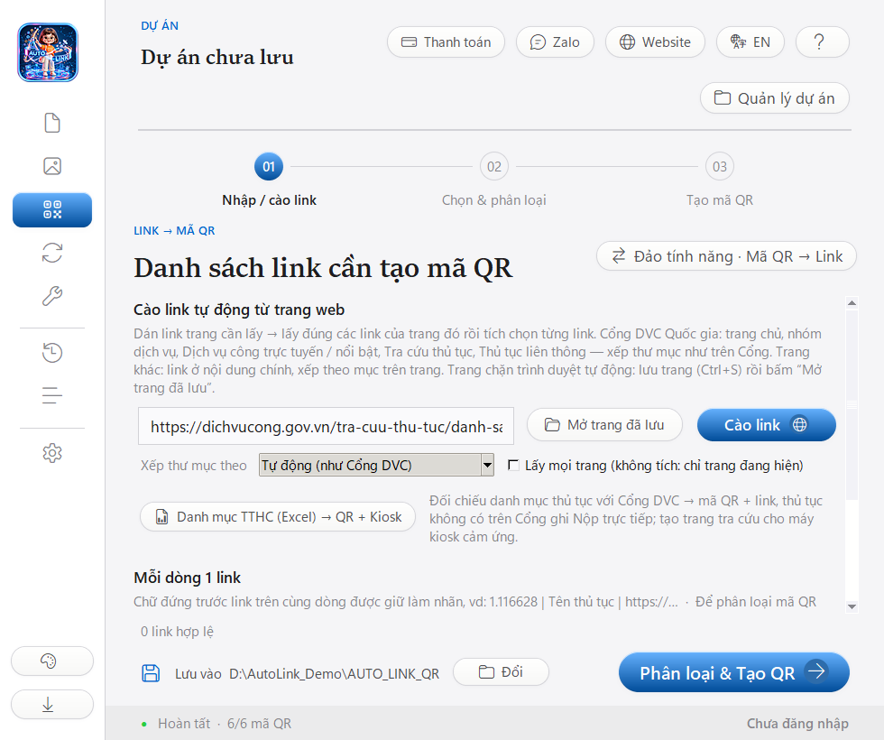

Cửa sổ hẹp (Snap nửa màn hình, máy tính bảng): menu trái thu thành **cột icon** (rê chuột / Tab hiện tên), hàng nút **tự xuống dòng**, trang dài **cuộn được**, nút chính luôn ghim đáy; hộp thoại không vượt quá màn hình. Được kiểm thử tự động trên 8 loại màn hình: HD 100 / 125 %, 1024 × 768, máy tính bảng 1280 × 800 150 %, Full HD 150 / 175 %, 2K 200 %, 4K 250 %.

---

## 💳 Bảng giá & kích hoạt

| Gói | Giá | Thời hạn | Gồm |
|---|---|---|---|
| 🎁 **Dùng thử** | Miễn phí | 3 ngày (1 lần / máy) | Đầy đủ mọi chức năng |
| ⭐ **Gói Pro · 1 tháng** | **49.000đ** | 31 ngày | **Tất cả chức năng** + cập nhật |
| 🥈 **Gói Pro · 3 tháng** | **139.000đ** | 92 ngày | Tiết kiệm **5 %** so với trả từng tháng |
| 🥇 **Gói Pro · 6 tháng** | **259.000đ** | 183 ngày | Tiết kiệm **12 %** |
| 🏆 **Gói Pro · 12 tháng** | **490.000đ** | 366 ngày | Tiết kiệm **17 %** — giá 10 tháng, **tặng 2 tháng** |

Hết 3 ngày dùng thử, các chức năng xử lý cần **gói Pro** — app tự hiện thông báo nâng cấp (khi mở app, khi bấm chức năng, hoặc đúng lúc hết hạn).

Giá hiện hành luôn hiển thị trong app (nút **💳 Thanh toán**). Bản quyền gắn với **Gmail + máy tính** đăng ký. Trả trước, không tự động trừ tiền; gia hạn bằng thanh toán gói tiếp theo — xem **[📜 Điều khoản sử dụng, quyền riêng tư & hoàn tiền](docs/DIEU_KHOAN.md)**.

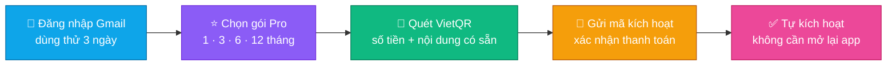
```mermaid
flowchart LR
    A["👤 Đăng nhập Gmail<br/>dùng thử 3 ngày"]:::blue --> B["⭐ Chọn gói Pro<br/>1 · 3 · 6 · 12 tháng"]:::violet
    B --> C["📱 Quét VietQR<br/>số tiền + nội dung có sẵn"]:::green
    C --> D["💬 Gửi mã kích hoạt<br/>xác nhận thanh toán"]:::amber
    D --> E["✅ Tự kích hoạt<br/>không cần mở lại app"]:::pink
    classDef blue fill:#0EA5E9,stroke:#0369A1,color:#fff
    classDef violet fill:#8B5CF6,stroke:#6D28D9,color:#fff
    classDef green fill:#10B981,stroke:#047857,color:#fff
    classDef amber fill:#F59E0B,stroke:#B45309,color:#fff
    classDef pink fill:#EC4899,stroke:#BE185D,color:#fff
```

1. Hết dùng thử, app hiện thông báo **yêu cầu nâng cấp gói Pro** (muốn nâng cấp sớm: **💳 Thanh toán › Nâng cấp Pro**) → chọn gói **1 tháng**, **3 tháng**, **6 tháng** hoặc **12 tháng** (mã QR đổi theo đúng số tiền gói đã chọn).
2. Quét mã **VietQR** bằng ứng dụng ngân hàng bất kỳ — **số tiền và nội dung chuyển khoản đã điền sẵn** (nội dung riêng cho máy của bạn, vui lòng giữ nguyên).
3. Bấm **Sao chép mã kích hoạt** → gửi qua **Zalo 0788962643** để được đối chiếu số tiền và nội dung chuyển khoản. Có thể gửi kèm ảnh giao dịch để hỗ trợ tra cứu.
4. Sau khi chủ sản phẩm xác nhận và cấp giấy phép, app **tự nhận bản quyền**: mỗi phút khi mở trang thanh toán, hoặc bấm **Kiểm tra ngay**. Mã `AL1.…` dùng để kích hoạt thủ công khi cần.

**Gia hạn:** thanh toán gói tiếp theo với đúng Gmail, máy và nội dung chuyển khoản. Công cụ quản trị có thể cộng thời gian còn lại khi gia hạn sớm; app tự nhận giấy phép mới và cập nhật ngày hết hạn sau khi được duyệt. Hiện dùng bước xác nhận của chủ sản phẩm, chưa tự đối soát giao dịch ngân hàng.

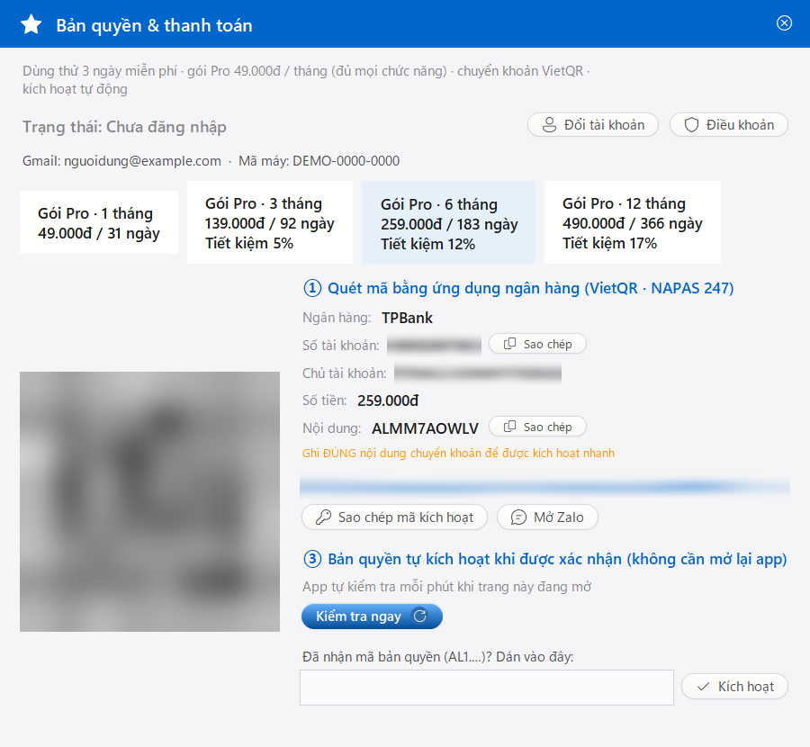

> [!NOTE]
> Mua cho **cả cơ quan / nhiều máy**, xuất hoá đơn, đổi máy tính: liên hệ Zalo **0788962643**.

## 📞 Liên hệ & hỗ trợ

| | Kênh | |
|:-:|---|---|
| 💬 | **Zalo / điện thoại** | **[0788962643](https://zalo.me/0788962643)** — hỗ trợ cài đặt, mua bản quyền, báo lỗi |
| 🌐 | **Website** | **[mechamike.vercel.app](https://mechamike.vercel.app/)** |
| 🐞 | **Báo lỗi** | Gửi kèm **⚙️ Cài đặt › 🧾 Nhật ký lỗi** qua Zalo |

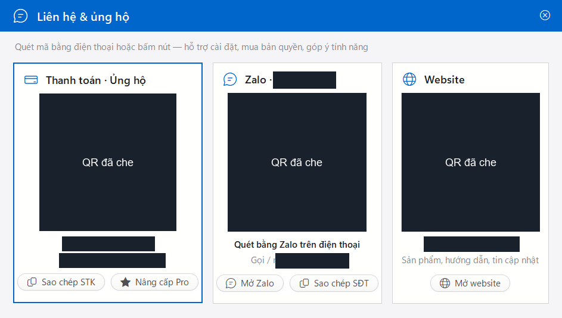 Nút <b>Thanh toán · Zalo · Website</b> có sẵn trên thanh đầu của app

---

## 🔒 Dữ liệu & quyền riêng tư

> [!IMPORTANT]
> Tài liệu được **xử lý trên máy**, không tải lên máy chủ. App kết nối mạng khi bạn cào link hoặc đối chiếu Cổng DVC; kiểm tra bản quyền bằng **mã băm tài khoản** và tải cấu hình cửa hàng đã ký; kiểm tra / tải bản cập nhật; đăng nhập Google khi bạn bấm; hoặc **tải file lên Google Drive của chính bạn** khi bạn bấm **Tải lên & lấy link** / bật công tắc (quyền `drive.file`: app chỉ thấy file nó tải lên). Gmail và tài liệu không được gửi lên GitHub để kiểm tra bản quyền.

| | Nội dung | Vị trí |
|:-:|---|---|
| ⚙️ | Cài đặt, công thức, quy tắc thể thức | `%APPDATA%\AutoLink\` |
| 🔳 | Mã QR + sổ lịch sử `LichSu_MaQR.csv` | `Documents\AUTO_LINK_QR` (đổi được trong Cài đặt) |
| 📁 | Dự án `.autolink` | `Documents\AUTO_LINK_Projects` |
| 🧾 | Nhật ký lỗi (gửi IT khi cần hỗ trợ) | `%APPDATA%\AutoLink\error.log` — mở ở **Cài đặt › Nhật ký lỗi** |
| 🔤 | Bộ nhận dạng chữ OCR (giải nén 1 lần) | `%LOCALAPPDATA%\AutoLink\ocr\` |
| 👤 | Bản quyền (Gmail, hạn dùng) | `%APPDATA%\AutoLink\license.json` |
| ☁️ | Phiên Google Drive (mã hoá theo tài khoản Windows) + hàng đợi tải dở | `%APPDATA%\AutoLink\google_drive.json`, `drive_queue.json` |

---

## 🛟 Xử lý sự cố

| | Hiện tượng | Cách xử lý |
|:-:|---|---|
| 🛡️ | **"Windows protected your PC"** | Bấm **More info → Run anyway** (ứng dụng chưa ký mã) |
| 💻 | Màn hình nhỏ / phóng chữ lớn: thiếu nút, chữ bị cắt | Cập nhật bản mới nhất — giao diện co giãn mọi màn hình (1024 × 768 → 4K, 100 – 250 %) |
| 💳 | Đã chuyển khoản nhưng chưa kích hoạt | Mở **Thanh toán › Kiểm tra ngay**; vẫn chưa được thì nhắn Zalo **0788962643** kèm mã kích hoạt và thông tin giao dịch để đối chiếu |
| 🔁 | Đổi máy tính / cài lại Windows | Bản quyền gắn với máy — nhắn Zalo kèm **mã kích hoạt** trên máy mới để được chuyển bản quyền |
| 🔐 | Bấm **Đăng nhập Google** không thấy mở trang | Bản 8.2.0: bấm lại là mở lại đúng trang đăng nhập (lỡ đóng tab cũng được) |
| ⏳ | "Google Drive đang bận — tự tải tiếp sau N giây" | Bình thường khi nhiều người cùng tải — cứ để app tự chạy; lượt bị ngắt thì mở lại app, bấm **Tải lên** để tải tiếp |
| 🔄 | Không tự cập nhật | Mạng chặn GitHub — tải bản mới ở **[Releases](https://github.com/mikeTran99/Auto-Link/releases/latest)** rồi chạy đè |
| 🕒 | "Đồng hồ máy bị lùi" | Chỉnh lại ngày giờ Windows (tự động đồng bộ giờ) rồi mở lại app |
| 📎 | Không xuất được PDF từ Word / Excel / PowerPoint | Máy chưa cài Microsoft Office — các chức năng khác vẫn dùng bình thường |
| 🔑 | "file được đặt mật khẩu mở" | Mở bằng Office, gỡ mật khẩu (**File › Info › Protect**) rồi làm lại |
| 📄 | PDF kết quả mang tên mới (`…_1.pdf`) | File cùng tên đang mở trong trình xem PDF nên không ghi đè được |
| 🔤 | PDF → Word / OCR mất dấu | Tích **Nhận dạng lại cả trang đã có sẵn chữ**; scan từ 300 dpi |
| 🚫 | "Windows đang chặn ghi vào…" | **Windows Security › Bảo vệ khỏi ransomware**: cho phép `Auto_Link.exe`, hoặc chọn thư mục kết quả khác |
| 🦠 | Phần mềm diệt virus chặn file | Tải từ Releases chính thức, đối chiếu SHA-256; nếu vẫn bị chặn, gửi tên phần mềm diệt virus và thông báo lỗi cho hỗ trợ |

---

## 📜 Nhật ký thay đổi

> [!TIP]
> **Mới nhất — 8.3.0:** **Kiểm tra thể thức NĐ 30/2020** đủ 29 loại văn bản, 6 nhóm kiểm tra, màn **duyệt từng mục / duyệt tất cả**, bản sao `…_dung_the_thuc.docx` + báo cáo Excel; **nhận dạng chữ qua Google Drive** (mặc định tắt). **8.2.0:** **PDF → Mã QR**; **Google Drive chỉ cần đăng nhập Gmail**, tải hàng nghìn file bền khi Google bận, tải tiếp đúng chỗ dừng; **gói 1 / 3 / 6 / 12 tháng**; **bộ cài từng bước** có lối tắt Desktop. **8.1.x:** cập nhật 1 chạm, Đối chiếu dữ liệu, File → Link Google Drive, PDF → Word / Excel chuyển thật.

Xem đầy đủ ở **[📜 CHANGELOG.md](CHANGELOG.md)** và **[🏷️ Releases](https://github.com/mikeTran99/Auto-Link/releases)**.

## ⚖️ Bản quyền

© 2026 [mikeTran99](https://github.com/mikeTran99). Bảo lưu mọi quyền — ứng dụng phát hành dạng tệp chạy, mã nguồn không công khai.
Thành phần mã nguồn mở đi kèm (Tesseract OCR, ReportLab, pypdf, PDFium, OpenCV, Pillow…) và giấy phép của chúng: **[📄 THIRD_PARTY_NOTICES.txt](THIRD_PARTY_NOTICES.txt)**.

Làm cho bộ phận một cửa 🇻🇳 · Nếu thấy hữu ích, hãy bấm ⭐ cho dự án

