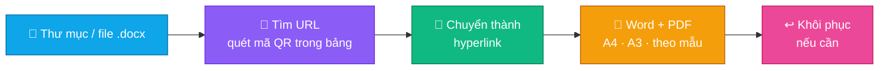
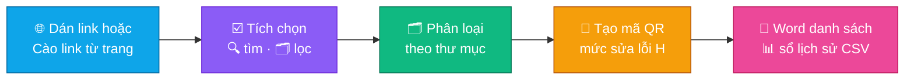

<h1 align="center"></h1>

<b>Bộ công cụ PDF, Văn thư &amp; Dịch vụ công cho bộ phận một cửa — Word → Hyperlink, Ảnh → PDF có link, Link → Mã QR, OCR tiếng Việt và 32 công cụ PDF / Office trong một ứng dụng Windows.</b>

🇻🇳 <b>Tiếng Việt</b> · 🇬🇧 <a href="docs/readme/README.en.md">English</a>

  &nbsp;
  &nbsp;
  

  
  
  
  
  
  

  <a href="#-cài-đặt">📥 Cài đặt</a> ·
  <a href="#-tính-năng">✨ Tính năng</a> ·
  <a href="#-các-chức-năng">🧭 Các chức năng</a> ·
  <a href="#-bộ-công-cụ--32-công-cụ">🧰 32 công cụ</a> ·
  <a href="#-dữ-liệu--quyền-riêng-tư">🔒 Quyền riêng tư</a> ·
  <a href="#-xử-lý-sự-cố">🛟 Xử lý sự cố</a> ·
  <a href="#-nhật-ký-thay-đổi">📜 Thay đổi</a>

---

## 📥 Cài đặt

### 1️⃣ Tải về

Vào **[Releases](https://github.com/mikeTran99/Auto-Link/releases/latest)** và chọn một trong hai cách:

| | Tệp | Dùng khi | Ghi chú |
|:-:|---|---|---|
| 🚀 | **[Auto-Link-win.exe](https://github.com/mikeTran99/Auto-Link/releases/latest/download/Auto-Link-win.exe)** | Dùng ngay trên 1 máy | 1 tệp duy nhất — bấm đúp là chạy, không cần cài |
| 📦 | **[Auto-Link-win-setup.zip](https://github.com/mikeTran99/Auto-Link/releases/latest/download/Auto-Link-win-setup.zip)** | Cài cho cả cơ quan | Lối tắt Start + Desktop, gỡ trong **Settings › Apps**, IT chép lên thư mục mạng để các máy **tự cập nhật** |
| 🔐 | **[SHA256SUMS.txt](https://github.com/mikeTran99/Auto-Link/releases/latest/download/SHA256SUMS.txt)** | Kiểm tra tệp tải về | So với `Get-FileHash .\Auto-Link-win.exe` (PowerShell) |

### 2️⃣ Chạy / cài đặt

<b>🚀 Chạy trực tiếp — Auto-Link-win.exe</b>

 

1. Bấm đúp **`Auto-Link-win.exe`**.
2. Lần đầu mở mất vài giây để giải nén; các lần sau nhanh hơn.

> [!TIP]
> Nếu hiện bảng xanh **"Windows protected your PC"** (SmartScreen): bấm **More info** → **Run anyway**. Ứng dụng chưa mua chứng thư ký mã nên Windows cảnh báo ở lần đầu — không phải virus.

<b>📦 Cài cho người dùng / cả cơ quan — Auto-Link-win-setup.zip</b>

 

1. Giải nén **`Auto-Link-win-setup.zip`** (chuột phải → **Extract All**).
2. Bấm đúp **`Cai_dat.cmd`** → ứng dụng cài vào `%LOCALAPPDATA%\Programs\AutoLink` — **không cần quyền quản trị**, có lối tắt Start + Desktop, mục gỡ trong **Settings › Apps**.
3. Bộ cài tự kiểm tra mã **SHA-256** của `Auto_Link.exe` theo `version.json`: tệp chép dở / bị sửa sẽ không được cài.

> [!NOTE]
> **Cho IT — tự cập nhật qua mạng nội bộ:** chép thư mục đã giải nén lên 1 thư mục mạng mà **chỉ IT có quyền ghi** (vd `\\may_chu\PhanMem\AutoLink`), người dùng chạy `Cai_dat.cmd` từ đó. Có bản mới → chép đè thư mục đó; lần mở kế tiếp mỗi máy tự thấy, hỏi rồi tự thay (kiểm tra SHA-256 trước khi thay, lỗi thì tự quay về bản cũ).

### 3️⃣ Kiểm tra máy

Mở **⚙️ Cài đặt › ✅ Kiểm tra hệ thống** → mọi mục (mã QR, Word, PDF tiếng Việt, OCR, Microsoft Office) phải có dấu ✓.

### 💻 Yêu cầu hệ thống

| | Thành phần | Yêu cầu |
|:-:|---|---|
| 🪟 | Hệ điều hành | Windows 10 / 11 **64-bit** |
| 🖥️ | Màn hình | Từ **1366 × 768**, mọi mức phóng chữ **100 – 200 %** (laptop 14 inch Full HD 150 % hiển thị đầy đủ) |
| 📎 | Microsoft Office 2013+ | Chỉ cần cho **Word / Excel / PowerPoint → PDF** và **nối file Office** |
| 🌐 | Mạng | Không cần — chỉ dùng khi bạn bấm **Cào link**, hoặc cập nhật qua thư mục mạng nội bộ |

---

## ✨ Tính năng

<table>
<tr>
<td width="33%" valign="top">

### 📝 Word → Hyperlink
Mọi URL dạng chữ trong `.docx` (kể cả trong bảng) thành **link bấm được**; quét **ảnh mã QR** trong bảng và điền link kế bên; xuất **Word + PDF** hàng loạt.

</td>
<td width="33%" valign="top">

### 🖼️ Ảnh → PDF có link
Ảnh `.jpg / .png…` thành PDF, **bấm vào ảnh là mở link** — tờ rơi, poster hướng dẫn thủ tục.

</td>
<td width="33%" valign="top">

### 🔳 Link → Mã QR
Dán danh sách hoặc **cào link đúng theo trang** (Cổng DVC Quốc gia & mọi website), **tích từng link**, tìm không dấu, lọc thư mục; mã QR **mức sửa lỗi H**.

</td>
</tr>
<tr>
<td valign="top">

### 📊 Theo dõi thủ tục
So với lần cào trước: thủ tục **mới**, **không còn**, **đổi tên / lĩnh vực** — ghi vào Nhật ký xử lý.

</td>
<td valign="top">

### 🧰 32 công cụ
Hàng loạt theo công thức, trộn văn bản, **số hóa hồ sơ**, sổ **văn bản đến**, **thể thức NĐ 30**, so sánh văn bản, **PDF/A**, che thông tin cá nhân…

</td>
<td valign="top">

### 🔤 OCR tiếng Việt
Tích hợp sẵn Tesseract 5 + mô hình tiếng Việt — PDF scan thành **PDF tìm kiếm được**, Word, Excel. Không cần cài thêm.

</td>
</tr>
<tr>
<td valign="top">

### ↩️ Khôi phục mọi lúc
Hoàn tác lượt vừa làm: file mới vào **Thùng rác**, file bị ghi đè **trả bản cũ**, đổi tên **trả tên cũ**. Nút **Xử lý tiếp** làm file khác ngay.

</td>
<td valign="top">

### 🗂️ Nhật ký & Lịch sử
**Ô tích chọn** từng dòng: sao chép, xuất, xoá, **khôi phục** mục đã xoá. Sổ lịch sử mã QR lưu vĩnh viễn (mở bằng Excel).

</td>
<td valign="top">

### 🔒 Riêng tư · ⌨️ Bàn phím · 🎨 4 giao diện
Xử lý **100 % trên máy**; dùng được hoàn toàn bằng bàn phím; 4 bảng màu sáng / tối; tự co giãn theo màn hình.

</td>
</tr>
</table>

---

## 🧭 Các chức năng

### 📝 Word → Hyperlink

| 1️⃣ Chọn dữ liệu | 2️⃣ Tuỳ chọn |
|---|---|
|  |  |

- 🔎 **Quét mã QR trong bảng** — giải mã ảnh QR trong bảng và điền link vào ô kế bên.
- ➕ **Thêm link mới vào cuối file** — chèn phần liên kết dịch vụ công (địa chỉ + chữ hiển thị tuỳ chọn).
- 📄 **Định dạng đầu ra** — PDF và Word / chỉ PDF / chỉ Word · **Khổ giấy**: A4 dọc, A4 ngang, A3 dọc, theo mẫu Word.

**3️⃣ Xử lý:** tiến độ từng file, nhật ký chi tiết có ô tích, **📂 Mở thư mục kết quả** và **↩️ Khôi phục** cả lượt.

### 🖼️ Ảnh → PDF có link

Chọn ảnh → nhập link → mỗi ảnh thành 1 trang PDF, **bấm vào ảnh là mở link**.

### 🔳 Link → Mã QR

- 🌐 **Cào link bám đúng trang đã dán** — Cổng DVC Quốc gia: trang chủ, nhóm dịch vụ, Dịch vụ công trực tuyến, Tra cứu thủ tục, Thủ tục liên thông; xếp thư mục như trên Cổng (lĩnh vực, cơ quan, đối tượng…). Trang khác: link ở nội dung chính, bỏ menu / đầu / chân trang.
- 💾 Trang chặn trình duyệt tự động: lưu trang (**Ctrl+S**) rồi bấm **Mở trang đã lưu**.
- ☑️ **Tích từng link hoặc cả thư mục** — chỉ tạo mã cho link đã chọn; danh sách trên 500 link không tự chọn hết để tránh nặng máy.

> [!TIP]
> Gõ **không dấu** vẫn tìm ra (`ho tich` → *Hộ tịch*). Đặt `[Tên thư mục]` ở một dòng riêng phía trên nhóm link để tự xếp mã QR vào thư mục con.

### 🗂️ Lịch sử mã QR & Nhật ký xử lý

Lưu **vĩnh viễn** mọi mã đã tạo: 🔍 tìm kiếm · ☑️ tích chọn · 📋 sao chép link · 🔳 mở mã / 📂 thư mục · 🗑️ xoá (có sao lưu) · ↩️ **khôi phục** mục vừa xoá.

---

## 🧰 Bộ công cụ — 32 công cụ

| Nhóm | Công cụ |
|---|---|
| 🏛️ **Văn thư & số hóa** | ⚡ Xử lý hàng loạt (lưu thành công thức) · ✉️ Trộn văn bản (mẫu Word + Excel) · 🗄️ Số hóa hồ sơ (scan → PDF tìm kiếm được + sổ danh mục) · 📥 Văn bản đến (tự điền sổ đăng ký) · 📐 Kiểm tra thể thức (NĐ 30) · 🔍 So sánh văn bản · 🏛️ Xuất PDF/A lưu trữ · 🕶️ Che thông tin cá nhân (CCCD, SĐT, email…) · 📂 Thư mục tự động (máy scan thả file → tự xử lý) |
| 📕 **PDF** | 🔗 Nối · ✂️ Tách · 🗑️ Xoá trang · 🔀 Sắp xếp trang · 🗜️ Nén · 🩹 Sửa tệp lỗi · 🔤 PDF → Văn bản (OCR) · 🔄 Xoay · 🔢 Đánh số trang · 💧 Dấu bản quyền · 📏 Cắt lề · 🔒 Đặt mật khẩu · 🔓 Gỡ mật khẩu |
| 🔁 **Chuyển đổi** | 🖼️ Ảnh → PDF · 🏞️ PDF → JPG (150 – 600 dpi) · 📘 Word → PDF · 📙 PowerPoint → PDF · 📗 Excel → PDF · 📝 PDF → Word · 📊 PDF → Excel · 🧩 Nối Word / Excel / PowerPoint |
| 🛠️ **Tiện ích** | 🔳 QR từ Excel / CSV · 🏷️ Đổi tên hàng loạt (tiền tố + số thứ tự, đổi đuôi) |

| ⚡ Xử lý hàng loạt | 🗄️ Số hóa hồ sơ |
|---|---|
|  |  |

Mỗi công cụ báo kết quả kèm **📄 Mở file / 📂 Mở thư mục**, **🔁 Xử lý tiếp** và **↩️ Khôi phục**; mọi thao tác ghi vào **Nhật ký xử lý**.

---

## ⚙️ Cài đặt & 🎨 giao diện

| ⚙️ Cài đặt | 🌙 Giao diện tối — Obsidian · Gold |
|---|---|
|  |  |

📁 Thư mục mã QR / dự án · ✅ Kiểm tra hệ thống · 🧾 Nhật ký lỗi · 💾 Sao lưu / khôi phục (chuyển máy) · 🔄 Cập nhật phần mềm · 🎨 4 giao diện (Cyber · Neon, Obsidian · Gold, Sci-Fi · Purple, Classic · Light) · ⌨️ Phím tắt **Ctrl+N / Ctrl+S / Ctrl+O**, **Tab / Shift+Tab**, **Enter / Space**, **Esc**.

---

## 🔒 Dữ liệu & quyền riêng tư

> [!IMPORTANT]
> Mọi tệp Word, PDF, ảnh, danh sách link được **xử lý ngay trên máy**, không tải lên bất kỳ máy chủ nào. Ứng dụng chỉ kết nối mạng khi **bạn bấm Cào link** (tải đúng trang bạn đã dán) hoặc khi kiểm tra **thư mục cập nhật nội bộ** do IT cấu hình.

| | Nội dung | Vị trí |
|:-:|---|---|
| ⚙️ | Cài đặt, công thức, quy tắc thể thức | `%APPDATA%\AutoLink\` |
| 🔳 | Mã QR + sổ lịch sử `LichSu_MaQR.csv` | `Documents\AUTO_LINK_QR` (đổi được trong Cài đặt) |
| 📁 | Dự án `.autolink` | `Documents\AUTO_LINK_Projects` |
| 🧾 | Nhật ký lỗi (gửi IT khi cần hỗ trợ) | `%APPDATA%\AutoLink\error.log` — mở ở **Cài đặt › Nhật ký lỗi** |
| 🔤 | Bộ nhận dạng chữ OCR (giải nén 1 lần) | `%LOCALAPPDATA%\AutoLink\ocr\` |

---

## 🛟 Xử lý sự cố

| | Hiện tượng | Cách xử lý |
|:-:|---|---|
| 🛡️ | **"Windows protected your PC"** | Bấm **More info → Run anyway** (ứng dụng chưa ký mã) |
| 💻 | Laptop 14 inch thiếu nút / chữ bị cắt | Cập nhật lên **7.0.1** trở lên — giao diện tự co giãn theo mức phóng chữ 100 – 200 % |
| 📎 | Không xuất được PDF từ Word / Excel / PowerPoint | Máy chưa cài Microsoft Office — các chức năng khác vẫn dùng bình thường |
| 🔑 | "file được đặt mật khẩu mở" | Mở bằng Office, gỡ mật khẩu (**File › Info › Protect**) rồi làm lại |
| 📄 | PDF kết quả mang tên mới (`…_1.pdf`) | File cùng tên đang mở trong trình xem PDF nên không ghi đè được |
| 🔤 | PDF → Word / OCR mất dấu | Tích **Nhận dạng lại cả trang đã có sẵn chữ**; scan từ 300 dpi |
| 🚫 | "Windows đang chặn ghi vào…" | **Windows Security › Bảo vệ khỏi ransomware**: cho phép `Auto_Link.exe`, hoặc chọn thư mục kết quả khác |
| 🦠 | Phần mềm diệt virus chặn file | Tệp đóng gói 1 file đôi khi bị báo nhầm — kiểm tra mã trong `SHA256SUMS.txt` rồi thêm ngoại lệ |

---

## 📜 Nhật ký thay đổi

> [!TIP]
> **Mới nhất — 7.0.1:** hiển thị đầy đủ trên laptop 14 inch (Full HD phóng chữ 150 %, màn 1366 × 768, màn 2K 200 %): menu trái tự nới theo chữ, nút luôn ghim đáy trang, cửa sổ vừa vùng làm việc.

Xem đầy đủ ở **[📜 CHANGELOG.md](CHANGELOG.md)** và **[🏷️ Releases](https://github.com/mikeTran99/Auto-Link/releases)**.

## ⚖️ Bản quyền

© 2026 [mikeTran99](https://github.com/mikeTran99). Bảo lưu mọi quyền — ứng dụng phát hành dạng tệp chạy, mã nguồn không công khai.
Thành phần mã nguồn mở đi kèm (Tesseract OCR, ReportLab, pypdf, PDFium, OpenCV, Pillow…) và giấy phép của chúng: **[📄 THIRD_PARTY_NOTICES.txt](THIRD_PARTY_NOTICES.txt)**.

Làm cho bộ phận một cửa 🇻🇳 · Nếu thấy hữu ích, hãy bấm ⭐ cho dự án

