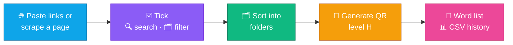

<h1 align="center"></h1>

<b>A PDF, clerical &amp; public-service toolkit for Vietnamese one-stop service desks — Word → Hyperlink, Image → linked PDF, Link → QR code, Vietnamese OCR, ⇄ reverse functions (with procedure names) and 36 PDF / Office tools in one Windows app. 3-day free trial.</b>

🇻🇳 <a href="../../README.md">Tiếng Việt</a> · 🇬🇧 <b>English</b>

  &nbsp;
  &nbsp;
  

  
  
  
  
  
  
  
  

---

## 📥 Installation

| | File | Use when | Notes |
|:-:|---|---|---|
| 🚀 | **[Auto-Link-win.exe](https://github.com/mikeTran99/Auto-Link/releases/latest/download/Auto-Link-win.exe)** | One PC, right now | Single portable file — double-click to run, no install |
| 📦 | **[Auto-Link-win-setup.zip](https://github.com/mikeTran99/Auto-Link/releases/latest/download/Auto-Link-win-setup.zip)** | A whole office | Start + Desktop shortcuts, uninstall in **Settings › Apps**; IT copies it to a network share for **automatic updates** |
| 🔐 | **[SHA256SUMS.txt](https://github.com/mikeTran99/Auto-Link/releases/latest/download/SHA256SUMS.txt)** | Verify the download | Compare with `Get-FileHash .\Auto-Link-win.exe` |

> [!TIP]
> If **"Windows protected your PC"** (SmartScreen) appears: click **More info** → **Run anyway**. The app is not code-signed yet, so Windows warns on first launch.

**Setup package:** extract the zip, double-click **`Cai_dat.cmd`** → installs per-user to `%LOCALAPPDATA%\Programs\AutoLink` (no admin rights), verifies the **SHA-256** of `Auto_Link.exe` against `version.json`. Put the extracted folder on a network share that only IT can write to: when IT replaces it with a newer build, every PC offers the update on next launch (hash-checked, with automatic rollback).

**First launch:** sign in with your **Gmail** → **3-day free trial** with every feature. When it ends, the app asks you to **upgrade to Pro — 49,000 VND / month** to keep using every feature (see **[💳 Pricing](#-pricing--activation)**). Switch the interface to English with the **EN** button on the top bar.

**Automatic updates:** when a new release is on GitHub, a bar shows the release notes → click **Update now** to download, verify the **digital signature + SHA-256**, swap the file and restart. A tampered download is never installed.

After installing, open **⚙️ Settings › ✅ System check** — every item should show ✓.

| | Component | Requirement |
|:-:|---|---|
| 🪟 | OS | Windows 10 / 11 **64-bit** |
| 🖥️ | Display | **Any size**: 1024 × 768 to 4K, scaling **100 – 250 %**, 14-inch laptops, tablets; small / snapped windows keep every control |
| 📎 | Microsoft Office 2013+ | Only for **Word / Excel / PowerPoint → PDF** and merging Office files |
| 🌐 | Network | Document processing **works offline**. Needed for sign-in / license activation, updates, or when you click **Scrape links** |

---

## ✨ Features

<table>
<tr>
<td width="33%" valign="top">

### 📝 Word → Hyperlink
Turns every plain-text URL in `.docx` files (tables included) into **clickable links**, decodes **QR images** in tables and fills in the link, exports **Word + PDF** in batch.

</td>
<td width="33%" valign="top">

### 🖼️ Image → linked PDF
Images become a PDF where **clicking the image opens the link** — flyers, procedure posters.

</td>
<td width="33%" valign="top">

### 🔳 Link → QR code
Paste a list or **scrape exactly the page you pasted** (Vietnam National Public Service Portal & any website), **tick individual links**, accent-insensitive search, folder filter; QR codes with **level-H** error correction.

**New in 8.0.1 — Excel procedure catalogue → QR + kiosk:** read multiple sheets, match procedures against the National Public Service Portal, and export a self-contained touch kiosk page, Excel results and a Word catalogue with QR codes.

</td>
</tr>
<tr>
<td valign="top">

### 📊 Procedure tracking
Compared with the previous scrape: **new**, **removed**, **renamed / re-categorised** procedures.

</td>
<td valign="top">

### 🧰 36 tools · 5 groups
Grouped by task with **quick search**: recipe-based batch processing, mail merge, **records digitisation**, **incoming-document register**, **Decree 30/2020 formatting check**, document compare, **PDF/A**, personal-data redaction…

</td>
<td valign="top">

### 🔤 Vietnamese OCR
Built-in Tesseract 5 with Vietnamese models — scans become **searchable PDF**, Word, Excel. Nothing else to install.

</td>
</tr>
<tr>
<td valign="top">

### ↩️ Undo everywhere
Revert the last run: new files go to the **Recycle Bin**, overwritten files are **restored**, renames are **reverted**. **Process more** reopens the tool instantly.

</td>
<td valign="top">

### 🗂️ Log & history
**Checkboxes** on every row: copy, export, delete and **restore** deleted items. The QR history is kept permanently (opens in Excel).

</td>
<td valign="top">

### 🔒 Private · ⌨️ Keyboard
Documents are processed **100 % locally**, never uploaded; fully keyboard-operable; adapts to any display scaling.

</td>
</tr>
<tr>
<td valign="top">

### 🎨 8 themes · 5 icon sets
**Neumorphism** light / dark, **Glass · Aurora**, **Next-Gen · Holo** plus 4 classic themes; Fluent, Fluent color, Classic, Emoji and Thin-line icons; smooth motion effects (optional).

</td>
<td valign="top">

### 🌐 English ⇄ Vietnamese
The **EN / VI** button on the top bar switches the whole interface instantly — no restart.

</td>
<td valign="top">

### 🔄 Auto-update · 💳 Trial
New release on GitHub → **one click to update** (signature-checked). **3-day trial**, then **Pro 49,000 VND / month**, **activates automatically** after payment.

</td>
</tr>
</table>

---

## ⇄ Reverse functions

Every main function has a **⇄ Reverse** button next to its title that opens the opposite direction:

| Main function | ⇄ Reverse | Output |
|---|---|---|
| 📝 Word → Hyperlink | 🔗 **Extract links** | Every link in Word / PDF (hyperlinks, plain-text URLs incl. tables, QR images): all occurrences with **procedure code + name** + unique list; optional **remove hyperlinks** keeping the text |
| 🖼️ Image → linked PDF | 🏞️ **PDF → images + links** | One JPG per page (100 – 300 dpi) + each page's links with procedure names |
| 🔳 Link → QR code | 📷 **QR code → links** | Reads **all** QR codes in images, PDFs (incl. scans) and Word files → links / text + **procedure code and name** |

**Report format:** 📊 Excel · 📝 Word · 📕 PDF · 📄 TXT · 🧾 CSV · or **📎 same as source** (Word → Word, PDF → PDF) — remembered for next time.

| 🔗 Extract links | 🏞️ PDF → images + links | 📷 QR code → links |
|---|---|---|
|  |  |  |

Found links can be sent straight to **Link → QR code** with one click (**“Create QR codes from these links”**).

---

## 🧭 Walkthrough

| 📝 Word → Hyperlink · options | ⚙️ Processing |
|---|---|
|  |  |
| 🔳 **Link → QR code** | ☑️ **Pick links to generate** |
|  |  |
| 🗂️ **QR history** | 🧰 **36 tools · accordion groups** |
|  |  |
| ⚡ **Batch processing** | 🗄️ **Records digitisation** |
|  |  |
| ⚙️ **Settings** | 🌙 **Dark theme — Obsidian · Gold** |
|  |  |
| 🌌 **Glass · Aurora** | 🌈 **Next-Gen · Holo** |
|  |  |
| ☁️ **Neumorphism · Light** | 🌐 **English interface** |
|  |  |

| Group | Tools |
|---|---|
| 🏛️ **Clerical & public service** | ⚡ Batch processing · ✉️ Mail merge · 🗄️ Records digitisation · 📥 Incoming documents · 📐 Formatting check (Decree 30) · 🔍 Document compare · 📂 Watch folder · 🏷️ Batch rename |
| 🔗 **Links & QR** | 🔗 Extract links · 📷 QR code → links · 🏞️ PDF → images + links · 🔳 QR from Excel / CSV |
| 🔁 **Convert & Office** | 📘 Word / 📗 Excel / 📙 PowerPoint → PDF · 🖼️ Images → PDF · 🏞️ PDF → JPG (150 – 600 dpi) · 📝 PDF → Word · 📊 PDF → Excel · 🔤 PDF → text (OCR) · 🧩 Merge Word / Excel / PowerPoint |
| 📕 **Arrange & edit PDF** | 🔗 Merge · ✂️ Split · 🗑️ Delete pages · 🔀 Reorder · 🔄 Rotate · 📏 Crop · 🔢 Page numbers · 💧 Watermark |
| 🔒 **Security, optimise & archive** | 🔒 Lock · 🔓 Unlock · 🕶️ Personal-data redaction · 🗜️ Compress · 🩹 Repair · 🏛️ PDF/A export |

---

## 💳 Pricing & activation

| Plan | Price | Duration | Includes |
|---|---|---|---|
| 🎁 **Trial** | Free | 3 days (once per PC) | Every feature |
| ⭐ **Pro · 1 month** | **49,000 VND** | 31 days | **Every feature** + updates |
| 🏆 **Pro · 12 months** | **490,000 VND** | 366 days | Price of 10 months — **2 months free** |

After the 3-day trial, processing features require **Pro** — the app shows an upgrade notice (at launch, when you use a feature, or the moment the trial ends).

Current prices are always shown in the app (**💳 Payment** button). A license is tied to the registered **Gmail + PC**. Prepaid, no auto-renewal — see the **[📜 Terms of use, privacy & refunds](../DIEU_KHOAN.md#english-summary)**.

1. When the trial ends the app asks you to **upgrade to Pro** (to upgrade early: **💳 Payment › Upgrade to Pro**) → choose **Pro 1 month** or **Pro 12 months**.
2. Scan the **VietQR** code with any Vietnamese banking app — **amount and transfer note are pre-filled** (the note is unique to your PC, please keep it).
3. Click **Copy activation code** → send it with the **transaction screenshot** via **Zalo 0788962643**.
4. Once confirmed, the license **activates automatically** — or paste the license code `AL1.…` you received and click **Activate**.

## 📞 Contact & support

| | Channel | |
|:-:|---|---|
| 💬 | **Zalo / phone** | **[0788962643](https://zalo.me/0788962643)** — setup help, licenses, bug reports, office-wide purchases |
| 🌐 | **Website** | **[mechamike.vercel.app](https://mechamike.vercel.app/)** |

## 🔒 Privacy

> [!IMPORTANT]
> All Word, PDF, image and link files are **processed on your PC** and never uploaded. The app only goes online when **you click Scrape links** (fetching exactly the page you pasted), to **check your license** (only a **hashed** account ID is sent — never your Gmail or documents) and to **check / download updates** from GitHub (or the internal update folder configured by IT).

Settings and the license file live in `%APPDATA%\AutoLink\`, QR codes and `LichSu_MaQR.csv` in `Documents\AUTO_LINK_QR`, projects in `Documents\AUTO_LINK_Projects`, the error log at `%APPDATA%\AutoLink\error.log`.

## 📜 Changelog · ⚖️ License

> [!TIP]
> **Latest — 8.0.1:** **Excel procedure catalogue → QR + touch kiosk**: match procedures against the National Public Service Portal and export a self-contained kiosk page plus Excel and Word QR reports; fixes missing plan names / payment QR codes after price changes and auto-update when launched from PowerShell 7.

See **[📜 CHANGELOG.md](../../CHANGELOG.md)** (Vietnamese) and **[🏷️ Releases](https://github.com/mikeTran99/Auto-Link/releases)**.

© 2026 [mikeTran99](https://github.com/mikeTran99). All rights reserved — distributed as a binary; source code is not public. Bundled open-source components and their licenses: **[📄 THIRD_PARTY_NOTICES.txt](../../THIRD_PARTY_NOTICES.txt)**.
