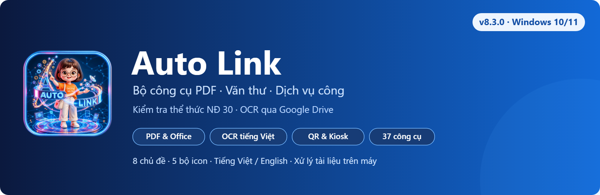
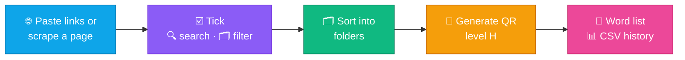

<h1 align="center"></h1>

<b>A PDF, clerical &amp; public-service toolkit for Vietnamese one-stop service desks — File → Link (Word → Hyperlink · Google Drive links), Image → linked PDF, Link → QR code, PDF → QR code, data reconciliation, Vietnamese OCR, ⇄ reverse functions and 37 PDF / Office tools in one Windows app. 3-day free trial.</b>

🇻🇳 <a href="../../README.md">Tiếng Việt</a> · 🇬🇧 <b>English</b>

  &nbsp;
  &nbsp;
  

  
  
  
  
  
  
  
  

> **Current release: [8.3.0 · 10 October 2026](https://github.com/mikeTran99/Auto-Link/releases/tag/v8.3.0).** New: a **Decree 30/2020 format checker** (29 document types, review and **approve each fix** or all at once, fixes go to a copy) and **text recognition via Google Drive** (optional — more accurate on blurry scans and accented capitals).

Illustrative screenshots have account details, private paths and all QR codes redacted. Use the QR shown inside the app for payment. Trial duration and prices follow the configuration displayed in the app.

---

## 📥 Installation

| | File | Use when | Notes |
|:-:|---|---|---|
| ⭐ | **[Auto-Link-Setup.exe](https://github.com/mikeTran99/Auto-Link/releases/latest/download/Auto-Link-Setup.exe)** | **New install / reinstall (recommended)** | **Step-by-step installer**: choose folder → ☑ **Desktop shortcut** → install → launch; Start menu shortcut, uninstall in **Settings › Apps**, no admin rights |
| 🚀 | **[Auto-Link-win.exe](https://github.com/mikeTran99/Auto-Link/releases/latest/download/Auto-Link-win.exe)** | One PC, right now | Single portable file — double-click to run, no install |
| 📦 | **[Auto-Link-win-setup.zip](https://github.com/mikeTran99/Auto-Link/releases/latest/download/Auto-Link-win-setup.zip)** | A whole office | Start + Desktop shortcuts, uninstall in **Settings › Apps**; IT copies it to a network share for **automatic updates** |
| 🔐 | **[SHA256SUMS.txt](https://github.com/mikeTran99/Auto-Link/releases/latest/download/SHA256SUMS.txt)** + **[signature](https://github.com/mikeTran99/Auto-Link/releases/latest/download/SHA256SUMS.txt.sig)** | Verify the download | SHA-256 and release signature; the app checks both before updating |

> [!TIP]
> If **"Windows protected your PC"** (SmartScreen) appears: click **More info** → **Run anyway**. The EXE has no Windows code-signing certificate yet. Downloads use SHA-256 and the author's release signature; use the official Releases page.

**Setup package:** extract the zip, double-click **`Cai_dat.cmd`** → installs per-user to `%LOCALAPPDATA%\Programs\AutoLink` (no admin rights), verifies the **SHA-256** of `Auto_Link.exe` against `version.json`. Put the extracted folder on a network share that only IT can write to: when IT replaces it with a newer build, every PC offers the update on next launch (hash-checked, with automatic rollback).

**First launch:** sign in with your **Gmail** → **3-day free trial** with every feature. When it ends, the app asks you to **upgrade to Pro — from 49,000 VND / month** (3, 6 and 12-month plans save more) to keep using every feature (see **[💳 Pricing](#-pricing--activation)**). Switch the interface to English with the **EN** button on the top bar.

**Automatic updates:** when a new release is on GitHub, a bar shows the release notes → click **Update now** to download, verify the **digital signature + SHA-256**, swap the file and restart. A tampered download is never installed.

After installing, open **⚙️ Settings › ✅ System check** to check QR, PDF, OCR, licensing and installed components. Office PDF export checks require the corresponding Microsoft Office application.

| | Component | Requirement |
|:-:|---|---|
| 🪟 | OS | Windows 10 / 11 **64-bit** |
| 🖥️ | Display | **Any size**: 1024 × 768 to 4K, scaling **100 – 250 %**, 14-inch laptops, tablets; small / snapped windows keep every control |
| 📎 | Microsoft Office 2013+ | Required for **Word / Excel / PowerPoint → PDF**, merging Office files and PDF export during mail merge |
| 🌐 | Network | Document processing **works offline**. Needed for sign-in / license activation, updates, **Scrape links** or matching the procedure catalogue against the public-service portal |

---

## ✨ Features

<table>
<tr>
<td width="33%" valign="top">

### 📝 Word → Hyperlink
Turns every plain-text URL in `.docx` files (tables included) into **clickable links**, decodes **QR images** in tables and fills in the link, exports **Word + PDF** in batch.

</td>
<td width="33%" valign="top">

### 🖼️ Image → linked PDF
Images become a PDF where **clicking the image opens the link** — flyers, procedure posters.

</td>
<td width="33%" valign="top">

### 🔳 Link → QR code
Paste a list or **scrape exactly the page you pasted** (Vietnam National Public Service Portal & any website), **tick individual links**, accent-insensitive search, folder filter; QR codes with **level-H** error correction.

**New in 8.3.0 — Decree 30/2020 format check** (29 document types, approve each fix) and **text recognition via Google Drive**. **PDF → QR code:** PDF files on your PC → one QR code per file that opens it (uploaded to your own Google Drive). **Excel procedure catalogue → QR + kiosk:** read multiple sheets, match procedures against the National Public Service Portal, and export a self-contained touch kiosk page, Excel results and a Word catalogue with QR codes.

</td>
</tr>
<tr>
<td valign="top">

### 📊 Procedure tracking
Compared with the previous scrape: **new**, **removed**, **renamed / re-categorised** procedures.

</td>
<td valign="top">

### 🧰 37 tools · 5 groups
Grouped by task with **quick search**: recipe-based batch processing, mail merge, **records digitisation**, **incoming-document register**, **Decree 30/2020 formatting check**, document compare, **PDF/A**, personal-data redaction…

</td>
<td valign="top">

### 🔤 Vietnamese OCR
Built-in Tesseract 5 with Vietnamese models — scans become **searchable PDF**, Word, Excel. Nothing else to install.

</td>
</tr>
<tr>
<td valign="top">

### ↩️ Undo everywhere
Revert the last run: new files go to the **Recycle Bin**, overwritten files are **restored**, renames are **reverted**. **Process more** reopens the tool instantly.

</td>
<td valign="top">

### 🗂️ Log & history
**Checkboxes** on every row: copy, export, delete and **restore** deleted items. The QR history is kept permanently (opens in Excel).

</td>
<td valign="top">

### 🔒 Private · ⌨️ Keyboard
Documents are processed **100 % locally**, never uploaded; fully keyboard-operable; adapts to any display scaling.

</td>
</tr>
<tr>
<td valign="top">

### 🎨 8 themes · 5 icon sets
**Neumorphism** light / dark, **Glass · Aurora**, **Next-Gen · Holo** plus 4 classic themes; Fluent, Fluent color, Classic, Emoji and Thin-line icons; smooth motion effects (optional).

</td>
<td valign="top">

### 🌐 English ⇄ Vietnamese
The **EN / VI** button on the top bar switches the whole interface instantly — no restart.

</td>
<td valign="top">

### 🔄 Auto-update · 💳 Trial
New release on GitHub → **one click to update** (signature-checked). **3-day trial**, then **Pro from 49,000 VND / month** (1 / 3 / 6 / 12 months), **activates automatically** after payment.

</td>
</tr>
</table>

---

## ✅ Decree 30/2020 format check · new in 8.3.0

Pick Word files → the app checks **29 administrative document types** (auto-detected) in **6 groups**: page & margins,
font & size, paragraphs, the 9 main components, additional components, spelling & punctuation. Each issue is one row
*current → suggested*: **tick items or Approve all**; items that need a human get clear guidance. Output is a **copy**
`…_dung_the_thuc.docx` (the original is untouched) plus an Excel report. Unit-specific rules can be imported / exported.

| Document type + check groups | Approve each suggestion |
|---|---|
|  |  |

**Text recognition via Google Drive** (Settings › Text recognition › Google — default **This PC**): page images go to
**your own Drive** and are deleted right away; on network errors the app falls back to Tesseract.

## ⇄ Reverse functions

Every main function has a **⇄ Reverse** button next to its title that opens the opposite direction:

| Main function | ⇄ Reverse | Output |
|---|---|---|
| 📝 Word → Hyperlink | 🔗 **Extract links** | Every link in Word / PDF (hyperlinks, plain-text URLs incl. tables, QR images): all occurrences with **procedure code + name** + unique list; optional **remove hyperlinks** keeping the text |
| 🖼️ Image → linked PDF | 🏞️ **PDF → images + links** | One JPG per page (100 – 300 dpi) + each page's links with procedure names |
| 🔳 Link → QR code | 📷 **QR code → links** | Reads **all** QR codes in images, PDFs (incl. scans) and Word files → links / text + **procedure code and name** |

**Report format:** 📊 Excel · 📝 Word · 📕 PDF · 📄 TXT · 🧾 CSV · or **📎 same as source** (Word → Word, PDF → PDF) — remembered for next time.

| 🔗 Extract links | 🏞️ PDF → images + links | 📷 QR code → links |
|---|---|---|
|  |  |  |

Found links can be sent straight to **Link → QR code** with one click (**“Create QR codes from these links”**).

---

## 🧭 Walkthrough

| 📝 Word → Hyperlink · options | ⚙️ Processing |
|---|---|
|  |  |
| 🔳 **Link → QR code** | ☑️ **Pick links to generate** |
|  |  |
| 🗂️ **QR history** | 🧰 **37 tools · accordion groups** |
|  |  |
| ⚡ **Batch processing** | 🗄️ **Records digitisation** |
|  |  |
| ⚙️ **Settings** | 🌙 **Dark theme — Obsidian · Gold** |
|  |  |
| 🌌 **Glass · Aurora** | 🌈 **Next-Gen · Holo** |
|  |  |
| ☁️ **Neumorphism · Light** | 🌐 **English interface** |
|  |  |
| ☁️ **File → Google Drive link** — thousands of files, resumes where it stopped | 🔐 **Google sign-in — just your Gmail** (no Client ID / secret) |
|  |  |
| 📄 **PDF → QR code** | 🔄 **Data reconciliation** |
|  |  |

| Group | Tools |
|---|---|
| 🏛️ **Clerical & public service (8)** | ⚡ Batch processing · ✉️ Mail merge · 🗄️ Records digitisation · 📥 Incoming documents · 📐 Formatting check (Decree 30) · 🔍 Document compare · 📂 Watch folder · 🏷️ Batch rename |
| 🔗 **Links & QR (5)** | 🖥️ Procedure catalogue → Kiosk · 🔗 Extract links · 📷 QR code → links · 🏞️ PDF → images + links · 🔳 QR from Excel / CSV |
| 🔁 **Convert & Office (9)** | 📘 Word / 📗 Excel / 📙 PowerPoint → PDF · 🖼️ Images → PDF · 🏞️ PDF → JPG (150 – 600 dpi) · 📝 PDF → Word · 📊 PDF → Excel · 🔤 PDF → text (OCR) · 🧩 Merge Word / Excel / PowerPoint |
| 📕 **Arrange & edit PDF (8)** | 🔗 Merge · ✂️ Split · 🗑️ Delete pages · 🔀 Reorder · 🔄 Rotate · 📏 Crop · 🔢 Page numbers · 💧 Watermark |
| 🔒 **Security, optimise & archive (6)** | 🔒 Lock · 🔓 Unlock · 🕶️ Personal-data redaction · 🗜️ Compress · 🩹 Repair · 🏛️ PDF/A export |

---

## 🖥️ Excel procedure catalogue → QR + Kiosk · new in 8.0.1

Open **Link → QR code › Excel procedure catalogue → QR + Kiosk**, or find it in **Toolbox › Links & QR**. Read multiple Excel sheets with procedure code, name, category and link columns. Codes are normalized, then matched against the National Public Service Portal by code or exact name. Matches receive a link and QR; unmatched procedures are marked **Submit in person** for review.

| Excel catalogue | Touch kiosk |
|---|---|
|  |  |

Outputs: a self-contained `Kiosk_TraCuuTTHC/index.html` with an Edge kiosk launcher, Excel results, a Word QR catalogue and PNG QR files. The kiosk has accent-insensitive search, an on-screen keyboard, department filters and a two-minute idle reset. The exported catalogue can be searched offline; portal matching and opening procedure pages require Internet. Regenerate the catalogue when procedures change.

## 💳 Pricing & activation

| Plan | Price | Duration | Includes |
|---|---|---|---|
| 🎁 **Trial** | Free | 3 days (once per PC) | Every feature |
| ⭐ **Pro · 1 month** | **49,000 VND** | 31 days | **Every feature** + updates |
| 🥈 **Pro · 3 months** | **139,000 VND** | 92 days | Save **5 %** vs paying monthly |
| 🥇 **Pro · 6 months** | **259,000 VND** | 183 days | Save **12 %** |
| 🏆 **Pro · 12 months** | **490,000 VND** | 366 days | Save **17 %** — price of 10 months, **2 months free** |

After the 3-day trial, processing features require **Pro** — the app shows an upgrade notice (at launch, when you use a feature, or the moment the trial ends).

Current prices are always shown in the app (**💳 Payment** button). A license is tied to the registered **Gmail + PC**. Prepaid, with no automatic bank charge; renew by paying for the next plan — see the **[📜 Terms of use, privacy & refunds](../DIEU_KHOAN.md#english-summary)**.

1. When the trial ends the app asks you to **upgrade to Pro** (to upgrade early: **💳 Payment › Upgrade to Pro**) → choose **1, 3, 6 or 12 months** (the QR code follows the selected amount).
2. Scan the **VietQR** code with any Vietnamese banking app — **amount and transfer note are pre-filled** (the note is unique to your PC, please keep it).
3. Click **Copy activation code** → send it via **Zalo 0788962643** so the owner can match the amount and transfer note. A transaction screenshot can help with lookup.
4. After the owner confirms payment and issues the license, the app **receives it automatically**: every minute while the payment window is open, or click **Check now**. The `AL1.…` code is a manual activation fallback.

**Renewal:** pay for the next plan using the same Gmail, PC and transfer note. The admin tool can carry over remaining time for early renewals; the app receives the new license and expiry date after approval. Activation currently uses owner confirmation and does not automatically reconcile bank transactions.

## 📞 Contact & support

| | Channel | |
|:-:|---|---|
| 💬 | **Zalo / phone** | **[0788962643](https://zalo.me/0788962643)** — setup help, licenses, bug reports, office-wide purchases |
| 🌐 | **Website** | **[mechamike.vercel.app](https://mechamike.vercel.app/)** |

## 🔒 Privacy

> [!IMPORTANT]
> Documents are **processed on your PC** and are never uploaded. Network access is used when you scrape links or match procedures against the public-service portal; check your license using a **hashed account ID** and fetch signed shop configuration; check / download updates; or use Google sign-in if configured and chosen. Your Gmail and documents are not sent to GitHub for license checks.

Settings and the license file live in `%APPDATA%\AutoLink\`, QR codes and `LichSu_MaQR.csv` in `Documents\AUTO_LINK_QR`, projects in `Documents\AUTO_LINK_Projects`, the error log at `%APPDATA%\AutoLink\error.log`.

## 📜 Changelog · ⚖️ License

> [!TIP]
> **Latest — 8.3.0:** **Decree 30/2020 format check** — 29 document types, 6 check groups, **approve each fix or all**, a `…_dung_the_thuc.docx` copy + Excel report; **text recognition via Google Drive** (off by default). **Earlier:** **PDF → QR code**; **Google Drive with just a Gmail sign-in**, robust uploads of thousands of files when Google is busy, resume where it stopped; **1 / 3 / 6 / 12-month plans**; **step-by-step installer** with a Desktop shortcut. **8.1.x:** one-click updates, data reconciliation, File → Google Drive link, real PDF → Word / Excel conversion.

See **[📜 CHANGELOG.md](../../CHANGELOG.md)** (Vietnamese) and **[🏷️ Releases](https://github.com/mikeTran99/Auto-Link/releases)**.

© 2026 [mikeTran99](https://github.com/mikeTran99). All rights reserved — distributed as a binary; source code is not public. Bundled open-source components and their licenses: **[📄 THIRD_PARTY_NOTICES.txt](../../THIRD_PARTY_NOTICES.txt)**.
