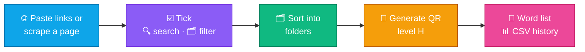

<h1 align="center"></h1>

<b>A PDF, clerical &amp; public-service toolkit for Vietnamese one-stop service desks — Word → Hyperlink, Image → linked PDF, Link → QR code, Vietnamese OCR and 32 PDF / Office tools in one Windows app.</b>

🇻🇳 <a href="../../README.md">Tiếng Việt</a> · 🇬🇧 <b>English</b>

  &nbsp;
  &nbsp;
  

  
  
  
  
  

---

## 📥 Installation

| | File | Use when | Notes |
|:-:|---|---|---|
| 🚀 | **[Auto-Link-win.exe](https://github.com/mikeTran99/Auto-Link/releases/latest/download/Auto-Link-win.exe)** | One PC, right now | Single portable file — double-click to run, no install |
| 📦 | **[Auto-Link-win-setup.zip](https://github.com/mikeTran99/Auto-Link/releases/latest/download/Auto-Link-win-setup.zip)** | A whole office | Start + Desktop shortcuts, uninstall in **Settings › Apps**; IT copies it to a network share for **automatic updates** |
| 🔐 | **[SHA256SUMS.txt](https://github.com/mikeTran99/Auto-Link/releases/latest/download/SHA256SUMS.txt)** | Verify the download | Compare with `Get-FileHash .\Auto-Link-win.exe` |

> [!TIP]
> If **"Windows protected your PC"** (SmartScreen) appears: click **More info** → **Run anyway**. The app is not code-signed yet, so Windows warns on first launch.

**Setup package:** extract the zip, double-click **`Cai_dat.cmd`** → installs per-user to `%LOCALAPPDATA%\Programs\AutoLink` (no admin rights), verifies the **SHA-256** of `Auto_Link.exe` against `version.json`. Put the extracted folder on a network share that only IT can write to: when IT replaces it with a newer build, every PC offers the update on next launch (hash-checked, with automatic rollback).

After installing, open **⚙️ Settings › ✅ System check** — every item should show ✓.

| | Component | Requirement |
|:-:|---|---|
| 🪟 | OS | Windows 10 / 11 **64-bit** |
| 🖥️ | Display | From **1366 × 768**, any scaling **100 – 200 %** |
| 📎 | Microsoft Office 2013+ | Only for **Word / Excel / PowerPoint → PDF** and merging Office files |
| 🌐 | Network | Not required — only when you click **Scrape links** or for internal updates |

---

## ✨ Features

<table>
<tr>
<td width="33%" valign="top">

### 📝 Word → Hyperlink
Turns every plain-text URL in `.docx` files (tables included) into **clickable links**, decodes **QR images** in tables and fills in the link, exports **Word + PDF** in batch.

</td>
<td width="33%" valign="top">

### 🖼️ Image → linked PDF
Images become a PDF where **clicking the image opens the link** — flyers, procedure posters.

</td>
<td width="33%" valign="top">

### 🔳 Link → QR code
Paste a list or **scrape exactly the page you pasted** (Vietnam National Public Service Portal & any website), **tick individual links**, accent-insensitive search, folder filter; QR codes with **level-H** error correction.

</td>
</tr>
<tr>
<td valign="top">

### 📊 Procedure tracking
Compared with the previous scrape: **new**, **removed**, **renamed / re-categorised** procedures.

</td>
<td valign="top">

### 🧰 32 tools
Recipe-based batch processing, mail merge, **records digitisation**, **incoming-document register**, **Decree 30/2020 formatting check**, document compare, **PDF/A**, personal-data redaction…

</td>
<td valign="top">

### 🔤 Vietnamese OCR
Built-in Tesseract 5 with Vietnamese models — scans become **searchable PDF**, Word, Excel. Nothing else to install.

</td>
</tr>
<tr>
<td valign="top">

### ↩️ Undo everywhere
Revert the last run: new files go to the **Recycle Bin**, overwritten files are **restored**, renames are **reverted**. **Process more** reopens the tool instantly.

</td>
<td valign="top">

### 🗂️ Log & history
**Checkboxes** on every row: copy, export, delete and **restore** deleted items. The QR history is kept permanently (opens in Excel).

</td>
<td valign="top">

### 🔒 Private · ⌨️ Keyboard · 🎨 4 themes
**100 % local** processing; fully keyboard-operable; 4 light / dark themes; adapts to any display scaling.

</td>
</tr>
</table>

---

## 🧭 Walkthrough

| 📝 Word → Hyperlink · options | ⚙️ Processing |
|---|---|
|  |  |
| 🔳 **Link → QR code** | ☑️ **Pick links to generate** |
|  |  |
| 🗂️ **QR history** | 🧰 **32 tools** |
|  |  |
| ⚡ **Batch processing** | 🗄️ **Records digitisation** |
|  |  |
| ⚙️ **Settings** | 🌙 **Dark theme — Obsidian · Gold** |
|  |  |

| Group | Tools |
|---|---|
| 🏛️ **Clerical & digitisation** | ⚡ Batch processing · ✉️ Mail merge · 🗄️ Records digitisation · 📥 Incoming documents · 📐 Formatting check (Decree 30) · 🔍 Document compare · 🏛️ PDF/A export · 🕶️ Personal-data redaction · 📂 Watch folder |
| 📕 **PDF** | 🔗 Merge · ✂️ Split · 🗑️ Delete pages · 🔀 Reorder · 🗜️ Compress · 🩹 Repair · 🔤 PDF → text (OCR) · 🔄 Rotate · 🔢 Page numbers · 💧 Watermark · 📏 Crop · 🔒 Lock · 🔓 Unlock |
| 🔁 **Convert** | 🖼️ Images → PDF · 🏞️ PDF → JPG (150 – 600 dpi) · 📘 Word / 📙 PowerPoint / 📗 Excel → PDF · 📝 PDF → Word · 📊 PDF → Excel · 🧩 Merge Word / Excel / PowerPoint |
| 🛠️ **Utilities** | 🔳 QR from Excel / CSV · 🏷️ Batch rename |

---

## 🔒 Privacy

> [!IMPORTANT]
> All Word, PDF, image and link files are **processed on your PC** and never uploaded. The app only goes online when **you click Scrape links** (fetching exactly the page you pasted) or when checking the **internal update folder** configured by IT.

Settings live in `%APPDATA%\AutoLink\`, QR codes and `LichSu_MaQR.csv` in `Documents\AUTO_LINK_QR`, projects in `Documents\AUTO_LINK_Projects`, the error log at `%APPDATA%\AutoLink\error.log`.

## 📜 Changelog · ⚖️ License

> [!TIP]
> **Latest — 7.0.1:** full layout on 14-inch laptops (Full HD at 150 %, 1366 × 768, 2K at 200 %).

See **[📜 CHANGELOG.md](../../CHANGELOG.md)** (Vietnamese) and **[🏷️ Releases](https://github.com/mikeTran99/Auto-Link/releases)**.

© 2026 [mikeTran99](https://github.com/mikeTran99). All rights reserved — distributed as a binary; source code is not public. Bundled open-source components and their licenses: **[📄 THIRD_PARTY_NOTICES.txt](../../THIRD_PARTY_NOTICES.txt)**.
